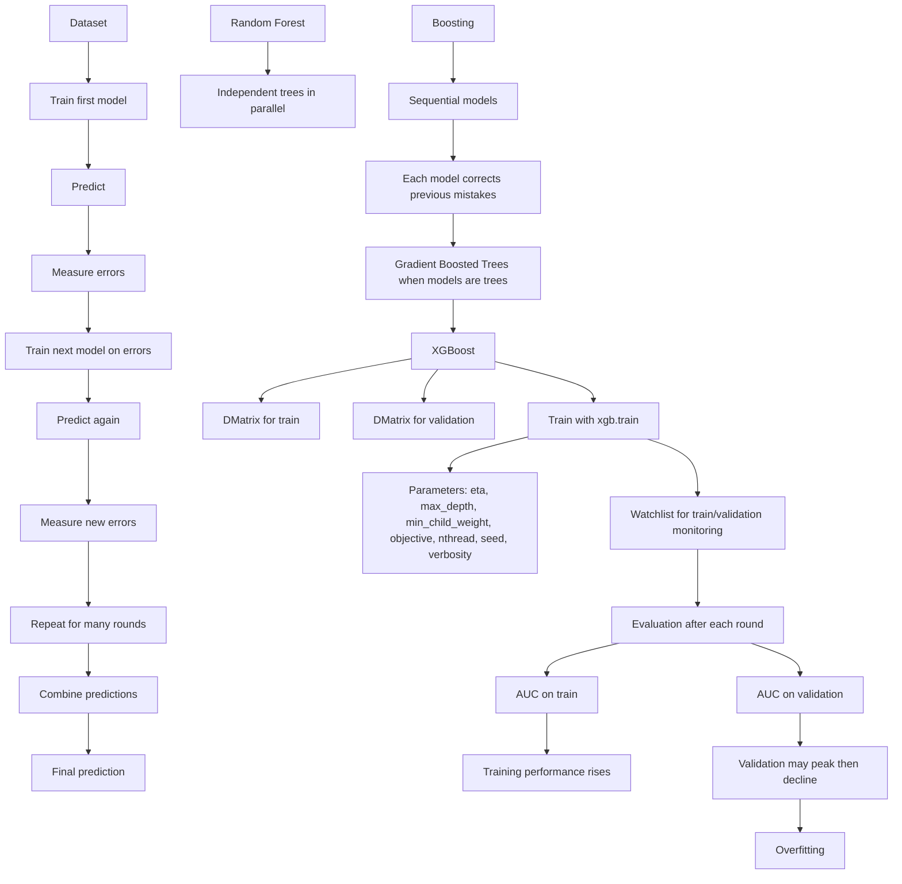

## 1. Course Notes

# Gradient Boosting with XGBoost

## 1.1 Random Forest vs. Boosting
### Random Forest
- Trains multiple decision trees independently on the same dataset.
- Combines predictions at the end, often by averaging.

### Boosting
- Trains models sequentially.
- Each new model is trained to correct the mistakes of the previous model.
- Predictions from multiple models are combined into one final prediction.

## 1.2 Core Idea of Gradient Boosting
- Start with a dataset.
- Train the first model.
- Measure its prediction errors.
- Train the next model based on those errors.
- Repeat for many iterations.
- Combine all model predictions into the final result.

## 1.3 Gradient Boosted Trees
- When the sequential boosting models are decision trees, the method is called:
  - Gradient Boosted Trees
  - Gradient Boosting Trees
  - Boosted Trees

## 1.4 XGBoost Library
- The lesson uses the `xgboost` library.
- Install with:
  - `pip install xgboost`
- Import with alias:
  - `import xgboost as xgb`

## 1.5 DMatrix Data Structure
- XGBoost uses a special internal format called `DMatrix`.
- It is optimized for faster training.
- Required inputs:
  - Feature matrix
  - Target variable (`label`)
  - Optional feature names

### Train and Validation Matrices
- Training data is wrapped into `dtrain`
- Validation data is wrapped into `dvalidation`

## 1.6 Training an XGBoost Model
- Use `xgb.train(...)`
- Main inputs:
  - `params`: model parameters
  - `dtrain`: training matrix
  - `num_boost_round`: number of boosting rounds / trees

## 1.7 Important Parameters
### `eta`
- Learning rate
- Controls how fast the model learns

### `max_depth`
- Controls tree depth / size

### `min_child_weight`
- Similar to minimum samples in a leaf node
- Controls how many observations must be in a leaf

### `objective`
- Defines the learning task
- For this binary classification task:
  - `binary:logistic`

### `nthread`
- Number of threads used for parallel training

### `seed`
- Random seed for reproducibility

### `verbosity`
- Controls how much training output is shown

## 1.8 Model Evaluation
- After training, predictions are made on the validation matrix using:
  - `model.predict(...)`
- The lesson evaluates performance with:
  - AUC score

## 1.9 Overfitting in XGBoost
- With default parameters, training performance keeps improving.
- Validation performance improves only up to a point, then stagnates or declines.
- This shows overfitting.
- Even with a small number of trees, performance can be quite good.
- The lesson notes that XGBoost can overfit, so tree count and tree size must be chosen carefully.

## 1.10 Watch List for Monitoring Training
- XGBoost can evaluate performance during training.
- A `watchlist` is used to specify datasets to monitor.
- The watchlist contains tuples of:
  - dataset matrix
  - dataset name
- This allows evaluation on both training and validation data after each boosting round.

## 1.11 Training Logs and Evaluation Metric
- XGBoost prints training progress to standard output.
- The lesson shows how to:
  - capture printed output in a notebook
  - parse the output line by line
  - extract iteration number, train metric, and validation metric
- The evaluation metric is set explicitly to:
  - `auc`
- This suppresses the default metric warning and makes training output easier to interpret.

## 1.12 Plotting Training vs Validation Performance
- The parsed output can be turned into a data frame.
- Then it can be plotted over iterations.
- The plot shows:
  - training AUC rising steadily to nearly perfect
  - validation AUC peaking earlier and then declining
- This visually confirms overfitting.

## 1.13 Next Step
- The next lesson will focus on tuning:
  - `learning rate (eta)`
  - `max_depth`
  - `min_child_weight`

---

## 2. Mermaid Diagram

---

## 3. Concepts with timestamps

- **0:00–0:46** — Introduces gradient boosting and contrasts it with random forest.
- **0:12–0:34** — Random forest recap: independent trees are trained and combined by averaging.
- **0:48–2:09** — Boosting process: train models sequentially, each correcting previous errors.
- **2:17–2:46** — Gradient boosted trees: boosting applied to decision trees.
- **2:49–3:14** — XGBoost library installation and import.
- **3:16–4:06** — `DMatrix` explained as XGBoost’s optimized training data structure.
- **4:16–4:54** — Training setup with `xgb.train`, including rounds/trees.
- **4:56–6:56** — Key XGBoost parameters explained:
  - `eta`
  - `max_depth`
  - `min_child_weight`
  - `objective = binary:logistic`
  - `nthread`
  - `seed`
  - `verbosity`
- **7:00–8:11** — Prediction and evaluation using AUC on the validation set.
- **8:13–8:37** — Demonstrates that changing the number of trees affects performance and can lead to overfitting.
- **8:39–9:24** — Introduces the watchlist for monitoring training and validation during boosting rounds.
- **9:26–11:14** — Shows training output over many rounds and explains the overfitting pattern.
- **11:16–12:12** — Reducing print frequency with `verbose` for easier inspection.
- **12:14–16:59** — Capturing XGBoost output in Jupyter and parsing it into structured values.
- **17:06–18:14** — Plotting train vs validation AUC to visualize overfitting.
- **18:16–19:02** — Wrap-up and preview of next lesson: tuning `eta`, `max_depth`, and `min_child_weight`.