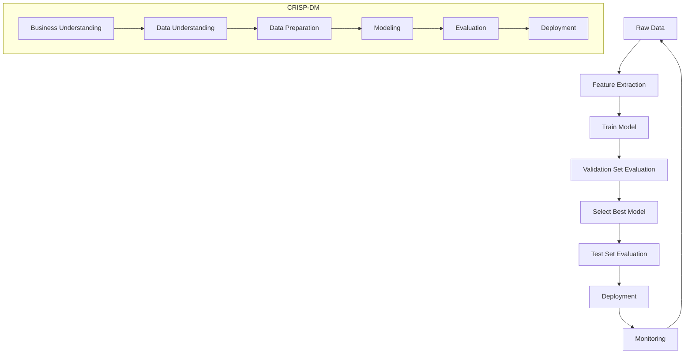

# 1. Title

## Machine Learning Fundamentals: Supervised Learning, Rule-Based Systems, Model Selection, CRISP-DM, NumPy, and Pandas

---

# 2. Overview

This session introduces the core ideas and workflow of machine learning through practical examples, especially:

- **Car price prediction** as the first supervised learning example
- **Spam detection** as a comparison between **rule-based systems** and **machine learning**
- **Supervised learning** as a formal machine learning setup
- **Model selection** using training, validation, and test data
- **CRISP-DM** as a practical framework for organizing ML projects
- **NumPy** for numerical computation
- **Linear algebra** operations used in ML
- **Pandas** for working with tabular data

The material builds intuition for how machine learning systems are designed, trained, evaluated, and deployed, while also introducing the Python tools needed to implement them.

---

# 3. Key Concepts

## Machine Learning
- Machine learning learns patterns from data rather than relying on hard-coded rules.
- A model is the result of training on data and can later make predictions on unseen examples.

## Features and Target
- **Features (`X`)**: the input information used for prediction.
- **Target (`y`)**: the output value or label the model learns to predict.

## Supervised Learning
- A learning setup where training examples include both input features and correct answers.
- Includes:
  - **Regression**: predict a number
  - **Classification**: predict a category
  - **Ranking**: order items by relevance or preference

## Rule-Based Systems
- Humans manually define if-then rules.
- Easy to start with, but hard to maintain as rules grow in number and complexity.

## Model Selection
- Different models are trained and compared.
- Validation data is used for choosing the best model.
- Test data is used once at the end to estimate final performance.

## CRISP-DM
A six-step process for organizing machine learning projects:
1. Business understanding
2. Data understanding
3. Data preparation
4. Modeling
5. Evaluation
6. Deployment

## NumPy
- Python library for numerical arrays and matrix operations.
- Supports vectorized element-wise operations and linear algebra primitives.

## Linear Algebra
- Vector and matrix operations are foundational for ML.
- Important operations include:
  - scalar multiplication
  - vector addition
  - dot product
  - matrix-vector multiplication
  - matrix-matrix multiplication
  - identity matrix
  - matrix inverse

## Pandas
- Python library for working with tabular data.
- Main abstraction: **DataFrame**
- Main column abstraction: **Series**

---

# 4. Detailed Explanations

## 4.1 Machine Learning vs. Rule-Based Systems

### Rule-Based Systems
In a rule-based spam filter, humans inspect data manually and encode patterns directly into code.

Examples of rules:
- If sender is `promotions@online.com`, mark as spam.
- If subject contains `"tax review"` and sender domain is `online.com`, mark as spam.
- If body contains `"deposit"`, mark as spam.

### Why this matters
Rule-based systems are intuitive at first, but they become difficult to maintain because:
- spam patterns change over time
- each new pattern requires new code
- rules can conflict with one another
- fixing one rule may break others

### Limitations
- brittle
- manual
- hard to scale
- difficult to keep up with changing behavior

---

## 4.2 Machine Learning Approach to Spam Detection

Instead of manually encoding rules, machine learning uses:
- a collection of labeled emails
- extracted features from each email
- a model trained to predict spam vs. not spam

### Typical ML pipeline
1. Collect data
2. Extract features
3. Train model
4. Use model for prediction

### Why it matters
ML systems can learn patterns automatically from examples and adapt better than hard-coded rules when behavior changes.

---

## 4.3 Features and Labels

### Features
Features are measurable characteristics of the input object.

For spam detection, examples include:
- title length
- body length
- sender name
- sender domain
- presence of words like `"deposit"`

These can be:
- **binary features**: true/false, often encoded as `1`/`0`
- numeric features
- categorical features

### Target variable
The target is the value to predict:
- `1` for spam
- `0` for not spam

### Why it matters
A machine learning model does not learn directly from raw objects; it learns from structured features.

---

## 4.4 Binary Feature Encoding

Binary features take only two values:
- true / false
- 1 / 0

Example:
- `title_longer_than_10 = 1`
- `body_longer_than_100 = 1`
- `sender_is_promotions_online = 0`
- `domain_is_online = 1`

### Engineering consideration
Binary features are simple and often effective, especially when derived from rule-like intuition.

---

## 4.5 Supervised Learning

Supervised learning means the model is trained with examples that include both:
- input features `X`
- correct target values `y`

The model learns a function:

```text
g(X) ≈ y
```

Where:
- `X` is the feature matrix
- `y` is the target vector
- `g` is the learned model

### Why it matters
This is the standard setup for many practical ML tasks where historical labeled data is available.

---

## 4.6 Types of Supervised Learning

### Regression
Predict a numeric value.

Examples:
- car price prediction
- house price prediction

Output:
- a number, often continuous

### Classification
Predict a category.

Examples:
- spam vs. not spam
- image of a car vs. not a car

#### Binary classification
A special case with two classes:
- spam / not spam
- fraud / not fraud

#### Multi-class classification
More than two classes:
- car / cat / dog
- multiple product categories

### Ranking
Predict an ordering of items by relevance or preference.

Examples:
- search engine results
- recommender systems
- e-commerce product ranking

### Tradeoffs
Different tasks require different output types, metrics, and model behavior.

---

## 4.7 Car Price Prediction Example

### Problem
A user wants to list a car for sale and needs help choosing a reasonable price.

### Available information
Examples of useful features:
- age/year
- manufacturer
- model
- mileage
- number of doors
- engine characteristics

### Target
- price

### How it works
A model is trained on many examples of cars with known prices. It learns relationships such as:
- older cars tend to be cheaper
- high mileage often lowers price
- some manufacturers are more expensive than others

### Why it matters
This shows the standard supervised learning pattern:
- observed inputs
- known outputs
- learned model
- prediction on new unseen data

---

## 4.8 Spam Detection Example

### Rule-based stage
Rules are created from observed patterns:
- sender domain
- subject keywords
- body keywords

### ML stage
Those same ideas can become features:
- sender is a known spam sender
- subject contains suspicious terms
- body contains suspicious terms

### Why it matters
Starting with rules can help identify useful features for machine learning.

---

## 4.9 Model Outputs and Decision Thresholds

For binary classification, many models output a probability, not a hard class label.

Example outputs:
- `0.8`
- `0.6`
- `0.1`
- `0.01`

A threshold is used to convert probability into a final decision:
- if `p >= 0.5`, classify as spam
- otherwise, classify as not spam

### Practical consideration
The threshold does not have to be `0.5`. It can be tuned depending on business goals:
- lower threshold: catch more spam, but risk more false positives
- higher threshold: fewer false positives, but more spam reaches inbox

---

## 4.10 Why Model Selection Is Needed

Different models may perform differently on the same problem:
- logistic regression
- decision trees
- random forest
- neural networks

The goal is to choose the model that performs best on unseen data.

### Important issue: overfitting to validation data
If you compare too many models on the same validation set, one model may appear best just by chance.

This is a **multiple comparison problem**:
- a model can “get lucky” on a specific validation subset
- its performance may not generalize

---

## 4.11 Train / Validation / Test Split

A standard workflow is:
- **training set**: fit the model
- **validation set**: compare models and tune decisions
- **test set**: final evaluation only

Typical split example:
- 60% train
- 20% validation
- 20% test

### Why it matters
This protects against overestimating model performance due to chance.

### Workflow
1. Train each candidate model on training data
2. Evaluate on validation data
3. Select the best model
4. Evaluate once on test data
5. If appropriate, retrain using train + validation and then test once

---

## 4.12 Final Model Training After Selection

After selecting the best model, you may combine training and validation data to train the final model.

### Why this matters
Once model selection is complete, the validation data no longer needs to be held out for model choice. Using more data can improve the final model.

### Caveat
The test set must remain untouched until the final evaluation.

---

## 4.13 CRISP-DM Workflow

CRISP-DM is a structured methodology for organizing ML projects.

### Step 1: Business understanding
- What problem are we solving?
- Is machine learning even needed?
- How do we measure success?

### Step 2: Data understanding
- What data is available?
- Is it reliable?
- Is it large enough?
- Are labels trustworthy?

### Step 3: Data preparation
- Clean data
- Fix missing values
- Transform raw data into model-ready format
- Extract features

### Step 4: Modeling
- Train candidate models
- Compare them
- Select the best one

### Step 5: Evaluation
- Check whether the selected model meets the business goal
- Confirm results on held-out data

### Step 6: Deployment
- Put the model into production
- Monitor performance
- Maintain reliability and scalability

### Why it matters
Machine learning projects are not just about training models. They require end-to-end project management.

---

## 4.14 NumPy

NumPy is a Python library for numerical computation.

### Why it matters
It provides:
- arrays
- fast vectorized operations
- matrix operations
- support for linear algebra
- random number generation

### Common array creation functions
- `np.zeros`
- `np.ones`
- `np.full`
- `np.array`
- `np.arange`
- `np.linspace`

### Vectorized operations
NumPy applies operations element-wise:
- add
- subtract
- multiply
- divide
- power
- comparisons

This is much cleaner and faster than writing loops.

### Example
```python
import numpy as np

a = np.arange(5)
b = a * 2 + 10
```

---

## 4.15 NumPy Indexing and Shapes

### One-dimensional arrays
Access elements with standard indexing:
```python
a[2]
```

### Two-dimensional arrays
Access rows and columns:
```python
n[0, 1]
n[:, 1]
n[1, :]
```

### Shape
The `shape` attribute gives dimensions.

Examples:
- 1D array: `(4,)`
- 2D array: `(5, 2)`

### Why it matters
Shape matching is essential in linear algebra and ML pipelines.

---

## 4.16 Random Number Generation in NumPy

NumPy can generate random arrays:
- uniform distribution
- normal distribution
- random integers

### Reproducibility
Use a random seed to make results repeatable.

```python
np.random.seed(2)
```

### Why it matters
Reproducibility is crucial in experiments, debugging, and model comparison.

---

## 4.17 Linear Algebra Operations

Linear algebra is the mathematical foundation of many ML algorithms.

### Scalar multiplication
Multiply every element of a vector by a scalar.

### Vector addition
Add corresponding elements of two vectors.

### Dot product
Produces a single number.

Formula:
```text
u · v = Σ u_i v_i
```

### Why it matters
Dot products are used in:
- linear regression
- neural networks
- similarity measures
- optimization

---

## 4.18 Matrix-Vector Multiplication

A matrix-vector product computes a dot product between each row of the matrix and the vector.

If `U` is a matrix with `k` rows and `v` is a vector, then the result is a vector of length `k`.

### Why it matters
This operation is one of the most common computations in machine learning.

---

## 4.19 Matrix-Matrix Multiplication

Matrix-matrix multiplication can be understood as multiple matrix-vector multiplications.

If:
- `U` is a matrix
- `V` is a matrix

then each column of the result is `U` multiplied by one column of `V`.

### Why it matters
This decomposition helps explain how matrix multiplication works internally.

---

## 4.20 Identity Matrix

An identity matrix has:
- `1`s on the diagonal
- `0`s elsewhere

Multiplying any compatible matrix by identity leaves it unchanged.

### Why it matters
The identity matrix is the matrix analogue of the number `1`.

---

## 4.21 Matrix Inverse

For a square matrix `A`, the inverse `A^-1` satisfies:

```text
A * A^-1 = I
```

where `I` is the identity matrix.

### Important limitation
Only square matrices can have inverses.

### Why it matters
Matrix inverses are useful in some ML derivations, especially classical linear models.

---

## 4.22 Pandas

Pandas is a Python library for working with tabular data.

### Main abstraction: DataFrame
A DataFrame is a table with rows and columns.

### Main column abstraction: Series
Each column in a DataFrame is a Series.

### Why it matters
Most real-world ML work begins with tabular data cleaning, inspection, transformation, and feature engineering.

---

## 4.23 Creating DataFrames

You can create DataFrames from:
- list of lists
- list of dictionaries

Example:

```python
import pandas as pd

data = [
    ["BMW", "X5", 2019, 3000, 300, 6, "automatic", "SUV", 65000],
    ["Toyota", "Corolla", 2018, 1800, 140, 4, "manual", "sedan", 18000],
]
columns = [
    "make", "model", "year", "engine_displacement",
    "horsepower", "num_cylinders", "transmission_type",
    "vehicle_style", "price"
]

df = pd.DataFrame(data, columns=columns)
```

---

## 4.24 Inspecting DataFrames

Common first step:
```python
df.head()
```

This shows the first rows and is useful for understanding structure and content.

---

## 4.25 Accessing Columns and Rows

### Column access
```python
df.make
df["make"]
df[["make", "model", "price"]]
```

### Row access by label
```python
df.loc[1]
df.loc[[1, 3]]
```

### Row access by position
```python
df.iloc[1]
df.iloc[[1, 3]]
```

### Why it matters
Label-based and position-based indexing solve different problems.

---

## 4.26 Adding and Removing Columns

### Add column
```python
df["id"] = [1, 2, 3, 4, 5]
```

### Remove column
```python
del df["id"]
```

---

## 4.27 Index in Pandas

The index identifies rows.

### Resetting index
```python
df = df.reset_index(drop=True)
```

### Why it matters
When filtering or reordering data, keeping row identity consistent is important.

---

## 4.28 Element-wise Operations in Pandas

Pandas Series support vectorized arithmetic and comparisons.

Examples:
```python
df["engine_hp"] / 100
df["year"] > 2015
df[(df["make"] == "Nissan") & (df["year"] > 2015)]
```

### Why it matters
This is the basis for filtering, transformation, and feature engineering.

---

## 4.29 String Operations in Pandas

String operations are available via `.str`.

Examples:
```python
df["vehicle_style"].str.lower()
df["vehicle_style"].str.replace(" ", "_")
```

### Why it matters
Text cleanup is common in data preparation.

---

## 4.30 Summary Statistics in Pandas

Useful methods:
- `mean()`
- `max()`
- `min()`
- `describe()`
- `nunique()`
- `isnull()`
- `sum()`

### Example
```python
df["price"].describe()
df.describe()
df["make"].nunique()
df.isnull().sum()
```

### Why it matters
These help you inspect distributions, missing values, and basic data quality.

---

## 4.31 Grouping in Pandas

Example: average price by transmission type

```python
df.groupby("transmission_type")["price"].mean()
```

### Why it matters
Grouping is essential for aggregating data by category, similar to SQL `GROUP BY`.

---

## 4.32 Converting DataFrames to Dictionaries

If needed, convert to record-oriented dictionaries:

```python
df.to_dict(orient="records")
```

### Why it matters
Useful for exporting or interfacing with other systems.

---

# 5. Examples

## Example 1: Spam Detection with Rules
```python
def is_spam(email):
    if email["sender"] == "promotions@online.com":
        return True
    if "tax review" in email["subject"].lower() and email["sender_domain"] == "online.com":
        return True
    if "deposit" in email["body"].lower():
        return True
    return False
```

### Limitation
This becomes fragile as new spam patterns appear.

---

## Example 2: Binary Feature Vector for an Email
```python
features = [
    int(len(subject) > 10),
    int(len(body) > 100),
    int(sender == "promotions@online.com"),
    int(sender_domain == "online.com"),
    int("deposit" in body.lower()),
]
```

---

## Example 3: Train / Validation / Test Split
```python
# Pseudocode
train_data = data[:6000]
val_data = data[6000:8000]
test_data = data[8000:]
```

---

## Example 4: NumPy Array Operations
```python
import numpy as np

a = np.arange(5)      # [0, 1, 2, 3, 4]
b = a * 2             # [0, 2, 4, 6, 8]
c = a + b             # [0, 3, 6, 9, 12]
mask = a >= 2         # [False, False, True, True, True]
filtered = a[mask]    # [2, 3, 4]
```

---

## Example 5: Pandas Filtering
```python
import pandas as pd

filtered = df[(df["make"] == "Nissan") & (df["year"] > 2015)]
```

---

## Example 6: Grouping by Category
```python
average_price = df.groupby("transmission_type")["price"].mean()
```

---

# 6. Mermaid Diagram



---

# 7. Common Pitfalls

- **Hard-coding rules too early**
  - Works initially but becomes hard to maintain.
- **Using test data during model selection**
  - Leads to overly optimistic performance estimates.
- **Assuming the validation set gives the final answer**
  - A model may get lucky on validation data.
- **Ignoring missing values**
  - Missing data can break model training or skew results.
- **Not checking feature shapes**
  - Shape mismatches are a common source of bugs in NumPy and ML code.
- **Confusing `.loc` and `.iloc` in Pandas**
  - One is label-based, the other is position-based.
- **Overwriting data without checking**
  - Especially when cleaning columns or resetting indexes.
- **Forgetting reproducibility**
  - Without a fixed seed, experiments may be hard to reproduce.
- **Treating the 0.5 threshold as universal**
  - Threshold should be chosen based on the problem and business cost of errors.

---

# 8. Best Practices

- Start with a simple baseline before building complex systems.
- Use rule-based analysis to discover useful candidate features.
- Separate training, validation, and test data strictly.
- Keep the test set untouched until final evaluation.
- Use feature engineering to convert raw data into model-ready form.
- Check data quality early:
  - missing values
  - wrong labels
  - inconsistent text formats
- Make transformations reproducible and explicit.
- Use vectorized NumPy/Pandas operations instead of loops when possible.
- Inspect data immediately after loading with `head()`, `describe()`, and missing-value checks.
- In ML projects, iterate:
  - define problem
  - evaluate data
  - train model
  - measure results
  - improve

---

# 9. Key Takeaways

- Machine learning replaces manually written rules with learned patterns from data.
- Supervised learning uses labeled examples with features `X` and target `y`.
- Regression predicts numbers; classification predicts categories; ranking orders items.
- Spam detection is a good example of the difference between rule-based systems and ML.
- Model selection requires training, validation, and test splits to avoid overfitting to validation data.
- CRISP-DM provides a practical end-to-end process for ML projects.
- NumPy is essential for numerical computation and linear algebra.
- Pandas is the standard tool for manipulating tabular data in Python.
- Data preparation and feature engineering are as important as model training.
- In real ML work, the model is only one part of a larger engineering and product workflow.