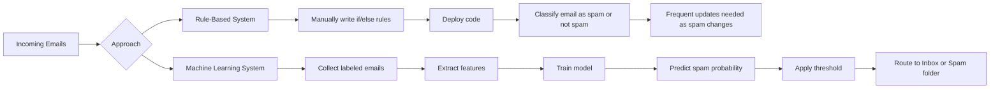

# Rule-Based Systems vs Machine Learning for Spam Detection

## Overview

Spam detection is a useful example for understanding the difference between **rule-based software** and **machine learning systems**.

- In a **rule-based system**, humans explicitly write conditions such as:
  - “If sender is `promotions@online.com`, mark as spam.”
  - “If subject contains `tax review`, mark as spam.”
- In a **machine learning system**, the model learns patterns from data:
  - We collect emails
  - Extract features
  - Provide labels such as `spam` or `not spam`
  - Train a model that predicts whether a new email is spam

The main idea is:

- **Rule-based systems** encode human knowledge directly in code.
- **Machine learning systems** learn the decision-making logic from examples.

This lesson uses spam filtering to show why machine learning is often a better choice when the patterns are complex, changing, and difficult to maintain manually.

---

## Key Concepts

### 1. Rule-Based System
A system where decisions are made using manually written rules.

**Why it matters**
- Easy to understand at first
- Works well for simple, stable problems
- Becomes difficult to scale when rules grow too many or too specific

**How it works**
- Engineers inspect examples
- Identify patterns
- Write `if/else` logic in code
- Deploy the logic directly in the application

**Limitations**
- Requires constant manual updates
- Breaks when attackers or user behavior changes
- Can become a maintenance nightmare

---

### 2. Machine Learning System
A system that learns a model from labeled examples instead of hard-coded rules.

**Why it matters**
- Better for problems where patterns are subtle and evolving
- Reduces the need to manually encode every rule
- Can generalize from examples to unseen cases

**How it works**
- Collect labeled data
- Extract features from raw inputs
- Train a model
- Use the trained model to make predictions on new data

**Limitations**
- Depends on data quality
- Requires feature engineering or good representations
- May produce probabilistic outputs, so a decision threshold is needed

---

### 3. Spam Classification
A **classification** task where the output is one of two categories:
- spam
- not spam

**Why it matters**
- Real-world classification problems often involve noisy, changing input patterns
- Email spam is a classic example of a binary classification problem

---

### 4. Features
A **feature** is a measurable property used to describe an email.

Examples:
- title length
- body length
- sender address
- sender domain
- presence of certain words like `deposit`

**Why it matters**
- Machine learning models do not work directly with raw emails in most simple setups
- Features convert raw text/email information into structured numeric input

**Common form in this example**
- Binary feature: `1` for true, `0` for false

---

### 5. Labels / Target Variable
The label is the correct answer for each training example.

For spam detection:
- `1` = spam
- `0` = not spam

**Why it matters**
- Supervised learning requires examples paired with known outputs
- The model learns to map features to labels

---

### 6. Model Training / Fitting
Training means using labeled data to learn a predictive function.

**Why it matters**
- The model learns from examples instead of fixed rules
- After training, the model can classify new emails

**How it works**
- Input: features + labels
- Output: trained model

---

### 7. Probabilistic Prediction
The model may output a probability that an email is spam, such as:
- `0.8` meaning 80% spam likelihood
- `0.1` meaning 10% spam likelihood

**Why it matters**
- Predictions are often uncertain
- Probabilities allow threshold-based decision making

---

### 8. Decision Threshold
A threshold converts probabilities into final classes.

Example:
- If `p(spam) >= 0.5`, classify as spam
- Otherwise classify as not spam

**Why it matters**
- Converts model output into an actionable system decision
- Threshold choice affects false positives and false negatives

---

## Detailed Explanations and Examples

### Rule-Based Spam Filtering

A rule-based spam filter might look like this conceptually:

```python
def classify_email(email):
    if email.sender == "promotions@online.com":
        return "spam"

    if "tax review" in email.subject and email.sender_domain == "online.com":
        return "spam"

    if "deposit" in email.body:
        return "spam"

    return "not spam"
```

### Why rule-based systems seem attractive
They are:
- simple
- transparent
- fast to implement for obvious spam patterns

### Why they fail in practice
Spam changes constantly.

A rule that works today may fail tomorrow:
- Spammers modify sender names
- Subject lines are changed to avoid detection
- Legitimate emails may use words that were previously spam indicators

This creates a maintenance loop:
1. Observe new spam pattern
2. Write a new rule
3. Deploy
4. Accidentally misclassify legitimate emails
5. Add more exceptions
6. Repeat indefinitely

Over time, the code base becomes:
- brittle
- hard to test
- difficult to extend
- prone to unintended side effects

---

### Why machine learning is a better fit

Instead of hard-coding every spam pattern, a machine learning approach learns from historical examples.

#### Step 1: Collect labeled emails
You need examples of:
- spam emails
- non-spam emails

A practical source is user feedback:
- users mark emails as spam
- those emails become training data

#### Step 2: Extract features
Raw emails are transformed into structured features.

Example binary features:
- `title_length_gt_10`
- `body_length_gt_threshold`
- `sender_is_promotions_online_com`
- `sender_domain_is_online_com`
- `subject_contains_tax_review`
- `body_contains_deposit`

These features are often inspired by the rules you would have written manually.

#### Step 3: Train a model
Feed the feature matrix and labels into a supervised learning algorithm.

Conceptually:

```python
model = train(features, labels)
```

The result is not a fixed set of rules but a learned function that can estimate spam probability.

---

### Example of feature encoding

Suppose an email has:
- long subject
- long body
- sender not equal to `promotions@online.com`
- sender domain not equal to `online.com`
- body contains `deposit`
- user marked it as spam

A possible feature vector could be:

```python
features = [
    1,  # title length > 10
    1,  # body length > threshold
    0,  # sender is promotions@online.com
    0,  # sender domain is online.com
    1,  # subject contains "tax review"
    1,  # body contains "deposit"
]
label = 1  # spam
```

This is a binary feature representation:
- `1` means true
- `0` means false

### Why binary features are useful
- easy to compute
- easy to interpret
- compatible with many standard models
- useful as a starting point before more advanced text representations

---

### From model output to system decision

A trained model may output probabilities:

```text
Email 1: 0.80
Email 2: 0.60
Email 3: 0.10
Email 4: 0.01
Email 5: 0.70
Email 6: 0.40
```

Using a threshold of `0.5`:

- `0.80` → spam
- `0.60` → spam
- `0.10` → not spam
- `0.01` → not spam
- `0.70` → spam
- `0.40` → not spam

### Why threshold choice matters
- A lower threshold catches more spam but may misclassify legitimate emails
- A higher threshold reduces false alarms but may let spam through

In spam filtering, the best threshold depends on business goals:
- minimize false positives if missing an email is very costly
- minimize false negatives if spam is very dangerous

---

### Comparison: rule-based vs machine learning

#### Rule-based system
- **Input:** data + code
- **Core logic:** manually written rules
- **Output:** classification decision
- **Maintenance burden:** high when rules keep changing

#### Machine learning system
- **Input:** data + labels
- **Core logic:** learning algorithm
- **Output:** trained model
- **Maintenance burden:** shifts from writing rules to collecting data, refining features, and retraining

A helpful mental model:

- In traditional software, **the logic is written by humans**
- In machine learning, **the logic is learned from data**

---

### Conceptual workflow diagram

#### Rule-based workflow
1. Observe examples
2. Write rules
3. Deploy code
4. Update rules when spam changes

#### Machine learning workflow
1. Collect labeled examples
2. Build features
3. Train model
4. Predict on new examples
5. Retrain when data changes

---

## Mermaid Diagram



---

## Common Pitfalls

### 1. Overusing manual rules
- Adding too many special cases makes the system hard to maintain.
- A rule that solves one problem may create new false positives.

### 2. Assuming one rule is enough
- Spam is adaptive.
- Attackers change language and formatting to evade static filters.

### 3. Poor feature design
- If features are too weak, the model cannot distinguish spam from non-spam well.
- Features should capture meaningful signals from the email content and metadata.

### 4. Weak label quality
- If users mislabel emails, the training data becomes noisy.
- Bad labels can degrade model performance.

### 5. Using an arbitrary threshold without evaluation
- `0.5` is a common default, not always the best choice.
- Threshold should be chosen based on error tradeoffs.

### 6. Ignoring concept drift
- Spam patterns evolve over time.
- Models and features may need periodic retraining and updates.

---

## Best Practices

### 1. Start with simple rules to understand the problem
- Manual rules help reveal useful signals.
- They can also inspire features for machine learning.

### 2. Use labeled data from real user behavior
- Spam and not-spam labels from users are valuable training data.
- Real-world labels are often more useful than synthetic examples.

### 3. Turn rule ideas into features
Examples:
- sender domain
- subject keywords
- message length
- suspicious phrases

This bridges the gap from heuristic thinking to learnable models.

### 4. Treat the threshold as a tunable parameter
- Choose it based on validation data and product goals.
- Spam filtering often benefits from tuning precision vs recall.

### 5. Retrain as data evolves
- Spam is not static.
- Periodic retraining keeps the classifier relevant.

### 6. Prefer maintainable abstractions
- Keep feature computation separate from model training and inference.
- This makes the pipeline easier to debug and improve.

---

## Key Takeaways

- Rule-based systems use explicit human-written logic.
- Machine learning systems learn patterns from labeled data.
- Spam detection is a classic binary classification problem.
- Features convert raw emails into structured inputs for a model.
- Labels tell the model the correct answer during training.
- The model often outputs probabilities, which are converted into spam/not-spam decisions using a threshold.
- Rule-based systems are easy to start with but become difficult to maintain as spam evolves.
- Machine learning is more flexible when patterns change frequently and manual rule writing becomes unsustainable.

---

## Potential Project Ideas

### 1. Build a simple rule-based spam filter
- Use sender address, subject keywords, and body keywords.
- Implement a basic `if/else` classifier in Python.

### 2. Build a feature-based spam classifier
- Create binary features from email metadata.
- Train a simple supervised learning model on labeled data.

### 3. Compare threshold choices
- Train a model and evaluate results at thresholds like `0.3`, `0.5`, and `0.7`.
- Study the tradeoff between false positives and false negatives.

### 4. Create a spam labeling interface
- Build a small tool where users can mark emails as spam or not spam.
- Store these labels for retraining.

### 5. Feature engineering experiment
- Test which features matter most:
  - sender domain
  - title length
  - suspicious words
  - body length
- Measure their effect on classification quality.

### 6. Simulate spam drift
- Start with one set of spam patterns.
- Then gradually change the patterns and observe how rule-based and ML systems behave differently.

### 7. Build an email routing pipeline
- Input: raw email
- Output: inbox or spam folder
- Include feature extraction, prediction, and thresholding as separate steps