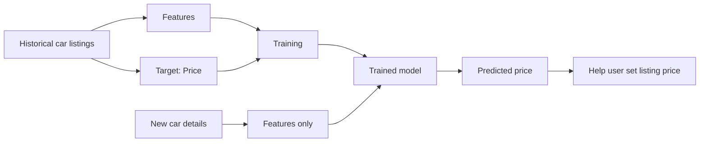

# 1. Title

# Machine Learning Fundamentals with a Car Price Prediction Example

---

# 2. Overview

Machine learning can be understood as a way to **learn patterns from historical data** and use those patterns to make predictions on new, unseen cases.

A practical example is **predicting the price of a used car** on a classifieds website:

- A seller wants to list a car.
- They need to choose a price.
- If the price is too high, the car may not sell.
- If the price is too low, the seller loses money.
- A machine learning model can help estimate a reasonable price based on the car’s characteristics.

This is a classic **supervised learning** setup:

- **Features**: the information we know about the car
- **Target**: the value we want to predict, which is the price
- **Model**: the learned system that maps features to predicted price

The core idea is that the model learns from past examples where the car characteristics and the actual price are already known.

---

# 3. Key Concepts

## Machine Learning
Machine learning is the process of **extracting patterns from data** so that a computer can make predictions or decisions without being explicitly programmed with hand-written rules for every case.

### Why it matters
- Real-world relationships are often too complex for fixed rules.
- Data often contains subtle patterns that humans can learn but not easily encode manually.
- Machine learning allows systems to improve from examples.

---

## Features
Features are the **inputs** used to describe an object.

For car pricing, features can include:

- Age of the car
- Manufacturer / brand
- Model
- Mileage
- Number of doors
- Year of manufacture
- Other relevant attributes

### Why it matters
Features provide the information the model uses to infer the target.

---

## Target
The target is the **value we want to predict**.

In the car example, the target is:

- **Price**

### Why it matters
The target defines the prediction task and what the model is trying to learn.

---

## Model
A model is the result of training on data. It stores the patterns learned from examples and uses them to produce predictions.

### Why it matters
The model is what transforms known features into a predicted target.

---

## Training Data
Training data is the dataset used to teach the model. It contains:

- Features
- Target values

Example:

| Age | Manufacturer | Mileage | Price |
|-----|--------------|---------|-------|
| 5   | BMW          | 60,000  | 18,000 |
| 8   | Volkswagen   | 120,000 | 7,500 |

### Why it matters
The model learns relationships from these examples, such as:
- older cars tend to be cheaper
- higher mileage often reduces price
- some manufacturers are generally more expensive than others

---

## Prediction / Inference
Once trained, the model can be used on new cars where the price is not yet known.

It takes:
- features of the new car

and outputs:
- predicted price

### Why it matters
This is the practical use of machine learning: making estimates on unseen data.

---

# 4. Detailed Explanations and Examples

## 4.1 The Car Pricing Problem

A car classifieds website allows users to list vehicles for sale. When a user creates a listing, they must enter a price manually.

This is difficult because the user has to balance two risks:

- **Price too high**: fewer buyers, slower sale
- **Price too low**: seller loses potential revenue

A machine learning system can assist by suggesting a price based on similar cars and historical market behavior.

---

## 4.2 Why Human Experts Can Estimate Price

Experienced car dealers or appraisers can often estimate a car’s value by looking at known attributes:

- year of manufacture
- brand
- mileage
- model
- condition-related signals

They can do this because they have learned patterns from observing many cars and their prices over time.

For example:

- a newer car is usually more expensive than an older one
- a BMW is often more expensive than a Volkswagen with similar characteristics
- higher mileage generally lowers value

Machine learning aims to reproduce this kind of expertise from data.

---

## 4.3 How Machine Learning Learns from Data

The training process uses a dataset where each row represents a car and each column contains information about it.

### Example structure

| Year | Manufacturer | Mileage | Doors | Price |
|------|--------------|---------|-------|-------|
| 2018 | BMW          | 40,000  | 4     | 25,000 |
| 2015 | VW           | 80,000  | 4     | 10,000 |
| 2020 | Toyota       | 20,000  | 4     | 22,000 |

The model examines many examples like this and learns how each feature tends to affect price.

### Important idea
The model does not memorize one exact rule like:

```text
if BMW then price = 25,000
```

Instead, it learns statistical relationships such as:

- brand influences price
- age influences price
- mileage influences price
- combinations of features matter together

---

## 4.4 Features vs Target

This distinction is essential in supervised learning.

### Features
Everything known about the car except the price.

Examples:
- age
- brand
- mileage
- model
- number of doors

### Target
What the model must predict.

Example:
- price

### Practical interpretation
If you know the features of a car but not the price, the model can estimate the price.

---

## 4.5 How the Trained Model Is Used

After training, the model becomes a reusable prediction tool.

### Workflow
1. User enters car details into a form.
2. The system extracts the relevant features.
3. These features are passed to the trained model.
4. The model outputs a predicted price.
5. The user sees the suggested price and can adjust it if needed.

### Why this is useful
- reduces guesswork
- helps sellers choose competitive prices
- improves user experience on the platform

---

## 4.6 Predictions Are Approximate, Not Exact

A model is not expected to predict the exact true price of every individual car.

Instead, it aims to be correct **on average**.

This means:
- for some specific cars, the prediction may be too high
- for others, it may be too low
- across many examples, the predictions should be reasonably accurate

### Why this matters
Machine learning is often about **probabilistic estimation**, not perfect certainty.

---

## 4.7 Practical Meaning of “Learning Patterns”

When a model learns patterns, it is capturing relationships such as:

- increasing age tends to decrease price
- increasing mileage tends to decrease price
- some manufacturers are associated with higher prices
- combinations of features can affect value in non-obvious ways

These patterns are learned from examples rather than explicitly written as rules.

---

# 5. Mermaid Diagram



---

# 6. Common Pitfalls

## Confusing features with target
A common mistake is including the target value among the features when training the model.

- Features = inputs
- Target = output to predict

If the price is used as an input during training, the model is effectively given the answer.

---

## Expecting exact predictions
A prediction model usually does not give the exact market price for every car.

It provides a statistically informed estimate, not a guaranteed truth.

---

## Using irrelevant features
Not every available attribute is useful.

Examples of weak or noisy features:
- arbitrary listing text fragments
- IDs with no relationship to value
- data fields that are not stable or meaningful

Poor feature choices can reduce model quality.

---

## Assuming more data always means better results
More data helps only if the data is:
- relevant
- accurate
- representative of real-world cases

Low-quality or biased data can produce poor models even if there is a lot of it.

---

## Ignoring market context
Car prices depend on market conditions, geography, and time.

A model trained on one market may not perform well in another market without adaptation.

---

# 7. Best Practices

## Start with a clear prediction target
Define exactly what should be predicted.

For this example:
- target = car price

---

## Choose meaningful features
Use attributes that plausibly affect the target:
- age
- brand
- mileage
- model
- condition indicators

---

## Use historical examples with known outcomes
The model should learn from past car listings where both:
- features are known
- price is known

---

## Evaluate predictions on unseen data
Test the model on cars it has not seen during training to understand how well it generalizes.

---

## Treat predictions as decision support
A model can assist the user, but the user may still want to:
- adjust the suggested price
- consider market timing
- consider vehicle condition not captured in the dataset

---

## Keep the user experience simple
If the model is embedded into a product, the goal is to make pricing easier, not to make the process more complicated.

---

# 8. Key Takeaways

- Machine learning learns patterns from data.
- In supervised learning, we have:
  - **features**: inputs
  - **target**: what we want to predict
  - **model**: learned function that maps features to target
- For car pricing:
  - features may include age, manufacturer, mileage, model, and more
  - target is price
- A trained model can estimate the price of a new car listing from its features.
- Predictions are usually approximate and correct on average, not exact for every individual case.
- Machine learning is useful when human expertise can be learned from examples and applied at scale.

---

# 9. Potential Project Ideas

## 1. Car Price Estimator
Build a simple regression model that predicts used car prices from structured data such as:
- year
- mileage
- brand
- model
- engine size
- number of doors

---

## 2. Price Suggestion Tool for Listings
Create a web form where a seller enters car information and receives a suggested listing price.

---

## 3. Feature Importance Exploration
Train a model and analyze which features influence price most strongly.

Questions to explore:
- Is mileage more important than brand?
- How much does age affect price?
- Do doors matter significantly?

---

## 4. Compare Human Heuristics vs Machine Learning
Create a simple rule-based pricing baseline and compare it to a trained model.

Examples of rule-based heuristics:
- reduce price by a fixed amount for each year of age
- reduce price based on mileage ranges

Then compare against ML performance.

---

## 5. Marketplace Price Analytics
Analyze patterns in historical listings:
- typical price by brand
- average price by age
- price distribution by mileage

This helps understand the data before building a model.