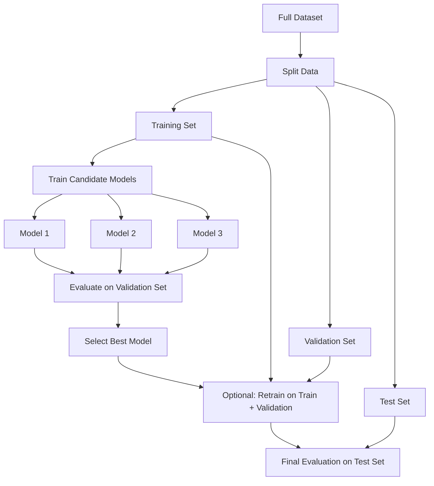

# Model Selection Process in Machine Learning

## Overview

Model selection is the process of choosing the best-performing model for a given problem by evaluating multiple candidate models on unseen data. The key idea is to simulate real-world usage as closely as possible: train a model on past data, then measure how well it performs on future-like data it has not seen before.

This step is essential because different model families behave differently on the same dataset. For example, logistic regression, decision trees, random forests, and neural networks may all produce different results on the same task. The goal is to identify the model that generalizes best, not just the one that fits the training data best.

A central challenge in model selection is avoiding overly optimistic evaluation. A model can appear strong on a single validation split simply by chance. To reduce this risk, the dataset is usually divided into three parts:

- **Training set**: used to fit the model
- **Validation set**: used to compare candidate models and tune choices
- **Test set**: used once at the end to estimate final performance

---

## Key Concepts

### 1. Model Selection
Choosing among multiple candidate models based on their performance on validation data.

- **Why it matters:** Different models have different inductive biases and can perform very differently depending on the dataset.
- **How it works:** Train each candidate on the training set, evaluate on the validation set, compare metrics, and select the best-performing model.
- **When to use it:** Whenever you need to compare model families, architectures, or hyperparameter settings.

### 2. Train / Validation / Test Split
A dataset is divided into three non-overlapping subsets.

- **Training set:** used to learn model parameters
- **Validation set:** used for model comparison and selection
- **Test set:** used only for final evaluation after selection is complete

- **Why it matters:** This separation helps estimate how the model will perform on new data.
- **Tradeoff:** Using more splits means less data for training, but better protection against misleading evaluation.

### 3. Generalization
The ability of a model to perform well on unseen data.

- **Why it matters:** A model that performs well only on training data is not useful in practice.
- **How it works:** Validation and test data approximate future unseen examples.
- **Limitation:** A model can still “get lucky” on one split, which is why test data is held out separately.

### 4. Multiple Comparison Problem
When many models are evaluated on the same validation set, one may appear best purely by chance.

- **Why it matters:** A model can overfit the validation set through repeated comparisons.
- **Consequence:** The selected model may not truly be the best in the real world.
- **Mitigation:** Use a separate test set for final confirmation.

### 5. Final Retraining
After selecting the best model, you can retrain it on the combined training + validation data before testing.

- **Why it matters:** This uses more data for learning, which can improve performance.
- **When to use it:** After model selection is complete and before final test evaluation.
- **Limitation:** The test set must still remain untouched until the very end.

---

## Detailed Explanations and Examples

### Simulating Real-World Use

In practice, a model is trained at one point in time and used later on new data. For example:

- In July, a model is trained on historical email data.
- In August, the model is used to classify new emails as spam or not spam.

When evaluating the model, we want to imitate this process:

1. Train on past data
2. Test on unseen future-like data

Because we cannot literally travel to the future, we simulate this by holding out part of the dataset.

---

### Train/Validation Split Example

Suppose we have a dataset of emails labeled as spam or not spam.

- Use 80% of the data for training
- Hold out 20% as validation data

The model is trained only on the training data:

- `X_train` — features from the training split
- `y_train` — labels from the training split

Then the trained model is applied to validation features:

- `X_val` — features from the validation split
- `y_val` — labels from the validation split

The model produces predicted probabilities, which are converted into binary predictions using a threshold such as `0.5`.

#### Example prediction logic

```python
probabilities = [0.8, 0.7, 0.6, 0.1, 0.9, 0.6]
predictions = [1 if p >= 0.5 else 0 for p in probabilities]
```

If the true labels are:

```python
y_val = [1, 0, 1, 0, 1, 0]
```

Then you compare predictions to actual labels and compute accuracy.

#### Accuracy calculation

If 4 out of 6 predictions are correct:

```text
accuracy = 4 / 6 = 0.666...
```

So the model has about **66.7% accuracy** on the validation set.

---

### Comparing Multiple Models

You can repeat the same evaluation procedure for several model families:

- Logistic Regression
- Decision Tree
- Random Forest
- Neural Network

Example validation accuracies:

- Logistic Regression: 66%
- Decision Tree: 60%
- Random Forest: 67%
- Neural Network: 80%

In this case, the neural network would be chosen as the best candidate based on validation performance.

#### Important caveat
A strong validation score does not guarantee the model is truly best. It may have performed well due to chance on that particular split.

---

### Why a Single Validation Set Can Be Misleading

To illustrate the issue, imagine using a random model that makes predictions by chance, like a coin flip. If you try many such models on the same validation set:

- One may accidentally match the validation labels very well
- Another may do poorly
- A third may look decent by luck

This is not because one model is actually better in a meaningful sense. It is a statistical artifact of repeated comparisons.

This is the essence of the **multiple comparison problem**: if you test enough models on the same validation set, one of them is likely to look unusually good by chance.

---

### Using a Test Set to Guard Against Luck

To reduce the risk of choosing a lucky model, split the data into three parts:

- **Training set**
- **Validation set**
- **Test set**

A common example split is:

- 60% training
- 20% validation
- 20% test

The workflow becomes:

1. Train candidate models on the training set
2. Evaluate them on the validation set
3. Choose the best model
4. Evaluate that chosen model once on the test set

The test set acts as a final sanity check. If validation accuracy is high but test accuracy drops significantly, the model may have overfit the validation split or gotten lucky.

---

### Full Model Selection Workflow

#### Step 1: Split the dataset
Divide the full dataset into three disjoint parts:

- training
- validation
- test

#### Step 2: Train candidate models
Train each model only on the training data.

#### Step 3: Validate models
Apply each trained model to the validation set and compute metrics such as accuracy.

#### Step 4: Select the best model
Choose the model with the best validation performance.

#### Step 5: Test the selected model
Apply the selected model to the test set to estimate final performance.

#### Step 6: Optionally retrain on train + validation
After selection, combine training and validation data and retrain the chosen model on the larger dataset, then use the test set for one final evaluation.

---

### Why Retraining on Train + Validation Can Help

Once the best model has been selected, the validation set has served its purpose. At that point, you can combine training and validation data to train a final model.

This is useful because:

- more data usually improves model quality
- the final model can learn from all labeled data except the test set

#### Important rule
Do **not** use the test set during model selection or retraining decisions. The test set must remain untouched until the very end.

---

### Example of Final Workflow

1. Split data into train / validation / test
2. Compare several models using train + validation
3. Select the best-performing model
4. Merge train + validation
5. Retrain the selected model on the merged data
6. Evaluate once on the test set

This gives both:

- a good final model
- a reliable estimate of real-world performance

---

## Mermaid Diagram



---

## Common Pitfalls

### 1. Using the validation set too many times
Repeatedly tuning models against the same validation set can cause overfitting to that split.

### 2. Evaluating on the test set during model selection
The test set should not influence model choice. If it does, it is no longer a true final evaluation set.

### 3. Not separating data properly
If train, validation, and test data overlap, performance estimates become unreliable.

### 4. Confusing validation and test roles
- Validation: compare models and tune decisions
- Test: final unbiased estimate

### 5. Assuming the best validation score always means the best real-world model
A model can look best on one split due to randomness.

### 6. Throwing away validation data permanently
After model selection, the validation data can often be merged back into training for the final model.

---

## Best Practices

- Keep the test set untouched until the end
- Use the validation set for model comparison, not final reporting
- Compare multiple candidate models, not just one
- After selecting the best model, retrain it on training + validation data if appropriate
- Use a consistent evaluation metric across models
- Be cautious when differences in validation score are small
- Consider data splitting carefully when the dataset is small
- Make sure the split reflects the real-world distribution as closely as possible

---

## Key Takeaways

- Model selection is about choosing the best model based on performance on unseen data.
- A dataset should usually be split into training, validation, and test sets.
- Training data is used to fit models; validation data is used to compare them.
- A single validation split can be misleading because of chance and the multiple comparison problem.
- The test set provides a final unbiased check after model selection.
- After choosing a model, you can often retrain it on training + validation data to improve the final model.
- Proper data splitting is one of the most important parts of practical machine learning.

---

## Potential Project Ideas

1. **Spam classifier model comparison**
   - Train logistic regression, decision tree, and random forest on the same spam dataset.
   - Compare validation accuracy and final test performance.

2. **Validation split experiment**
   - Split the same dataset multiple times.
   - Observe how model rankings change across splits.

3. **Multiple comparison demo**
   - Evaluate many random models on the same validation set.
   - Show that one model can look best by chance.

4. **Train/validation/test pipeline**
   - Build a reusable Python workflow that splits data, trains candidate models, compares validation metrics, and reports final test results.

5. **Final retraining exercise**
   - After selecting the best model, retrain it on training + validation data and compare its test performance with the earlier version.

6. **Threshold-based classification study**
   - Use predicted probabilities and experiment with different classification thresholds.
   - Observe how accuracy changes.

7. **Model selection report**
   - Create a notebook that documents candidate models, validation scores, selected model, and final test results in a reproducible way.