# NumPy Basics for Machine Learning

## Overview

NumPy is the core numerical computing library in Python and one of the most important tools in machine learning workflows. It provides:

- efficient array objects for numerical data
- vectorized operations without Python loops
- support for multi-dimensional data
- random number generation for simulations and reproducible experiments
- fast aggregation and element-wise computation

In machine learning, NumPy is used for:

- representing feature matrices and labels
- preprocessing numerical data
- implementing mathematical operations efficiently
- generating synthetic data
- interfacing with libraries like pandas, scikit-learn, and deep learning frameworks

---

## Key Concepts

### 1. Importing NumPy
- The standard convention is:

```python
import numpy as np
```

- `np` is used as a shorthand alias to make code shorter and more readable.

### 2. Creating Arrays
NumPy provides several common array constructors:

- `np.zeros(...)`: array filled with zeros
- `np.ones(...)`: array filled with ones
- `np.full(...)`: array filled with a specified value
- `np.array(...)`: convert Python lists into NumPy arrays
- `np.arange(...)`: create evenly spaced integer values
- `np.linspace(...)`: create evenly spaced values over an interval

### 3. Indexing and Mutation
- NumPy arrays use zero-based indexing.
- You can access and modify elements directly using indexing and assignment.

### 4. Multi-Dimensional Arrays
- NumPy supports 2D arrays and higher-dimensional arrays.
- Indexing uses one index per dimension.
- Rows and columns can be accessed and reassigned.

### 5. Random Number Generation
NumPy’s random module is used to generate synthetic data:

- `np.random.rand(...)`: uniform random numbers in `[0, 1)`
- `np.random.randn(...)`: standard normal random numbers
- `np.random.randint(...)`: random integers in a range
- `np.random.seed(...)`: fixes the random seed for reproducibility

### 6. Vectorized Operations
NumPy applies arithmetic and comparisons element-wise:

- scalar operations: `a + 1`, `a * 2`, `a / 2`
- array operations: `a + b`, `a > b`
- these operations avoid explicit loops and are much faster than Python lists

### 7. Boolean Masking
- Comparison operations return boolean arrays.
- Boolean arrays can be used to select elements satisfying a condition.

### 8. Aggregation / Reduction Operations
These summarize an array into a single value:

- `np.min(...)`
- `np.max(...)`
- `np.sum(...)`
- `np.mean(...)`
- `np.std(...)`

---

## Detailed Explanations and Examples

### Importing NumPy

```python
import numpy as np
```

This is the standard import style in data science and machine learning. Using the alias `np` avoids repeatedly typing `numpy`.

---

### Creating 1D Arrays

#### Zeros

```python
a = np.zeros(10)
print(a)
```

Creates a length-10 array filled with `0.0`.

#### Ones

```python
a = np.ones(10)
print(a)
```

Creates a length-10 array filled with `1.0`.

#### Full

```python
a = np.full(10, 2.5)
print(a)
```

Creates a length-10 array filled with `2.5`.

#### From a Python list

```python
a = np.array([1, 2, 3, 5, 7, 12])
print(a)
```

Converts a Python list into a NumPy array.

---

### Indexing and Modifying Elements

```python
a = np.array([1, 2, 3, 5, 7, 12])

print(a[2])   # third element, because indexing starts at 0
a[2] = 10
print(a)
```

Important points:

- `a[2]` accesses the third element
- assignment changes the array in place
- NumPy arrays are mutable

---

### Range Creation with `arange`

```python
a = np.arange(10)
print(a)
```

Produces integers from `0` to `9`.

```python
a = np.arange(3, 10)
print(a)
```

Produces integers from `3` to `9`.

This is similar to Python’s built-in `range`, but returns a NumPy array instead of an iterator.

---

### Evenly Spaced Values with `linspace`

```python
a = np.linspace(0, 1, 11)
print(a)
```

Creates 11 evenly spaced values from `0` to `1`, including both endpoints.

Why this matters:

- useful for plotting
- useful for sampling continuous intervals
- useful when you want a fixed number of points rather than a fixed step size

---

### Creating 2D Arrays

#### Using shape arguments

```python
a = np.zeros((5, 2))
print(a)
```

Creates a 2D array with:

- 5 rows
- 2 columns

#### From a list of lists

```python
n = np.array([
    [1, 2, 3],
    [4, 5, 6],
    [7, 8, 9]
])
print(n)
```

This becomes a 3×3 NumPy array.

---

### Indexing 2D Arrays

```python
print(n[0, 1])   # first row, second column
```

This returns the value at row `0`, column `1`.

#### Modifying a single element

```python
n[0, 1] = 20
print(n)
```

#### Accessing a full row

```python
print(n[1])      # second row
```

#### Replacing a full row

```python
n[2] = [10, 10, 10]
print(n)
```

The assigned value must match the row width.

#### Accessing a full column

```python
print(n[:, 1])   # all rows, second column
```

Column slicing uses `:` to mean “all rows”.

#### Replacing a full column

```python
n[:, 2] = [0, 1, 2]
print(n)
```

---

### Random Arrays

#### Uniform random numbers

```python
x = np.random.rand(5, 2)
print(x)
```

Creates a 5×2 array of random values in `[0, 1)`.

#### Reproducibility with a seed

```python
np.random.seed(2)
x = np.random.rand(5, 2)
print(x)
```

Setting a seed ensures the same pseudo-random values are generated each time.

Why this matters:

- makes experiments reproducible
- helps debugging
- makes results consistent across runs

#### Standard normal random numbers

```python
x = np.random.randn(5, 2)
print(x)
```

Generates values from the standard normal distribution.

#### Random integers

```python
x = np.random.randint(0, 100, size=(5, 2))
print(x)
```

Generates integers between `0` and `99`.

> Note: the upper bound is typically exclusive in `np.random.randint`.

---

### Vectorized Arithmetic

NumPy applies operations to every element automatically.

#### Add a scalar

```python
a = np.arange(5)
print(a + 1)
```

Result:

- every element is increased by 1

#### Multiply by a scalar

```python
print(a * 2)
```

#### Combine operations

```python
print(a * 2 + 10)
print(a ** 2)
```

This is one of the biggest advantages of NumPy over Python lists.

Why it matters:

- cleaner code
- faster execution
- no explicit `for` loops needed for basic numerical transformations

---

### Element-Wise Operations Between Arrays

```python
a = np.arange(5)
b = np.array([0.5, 1.4, 2.1, 3.2, 4.8])

print(a + b)
print(a * b)
print(a / b)
```

Operations happen element by element.

Requirements:

- arrays should have compatible shapes
- if shapes differ, NumPy may broadcast them or raise an error depending on compatibility

---

### Element-Wise Comparisons

```python
a = np.arange(5)

print(a >= 2)
```

This returns a boolean array such as:

```python
array([False, False,  True,  True,  True])
```

Comparing two arrays:

```python
b = np.array([0.5, 1.4, 2.1, 3.2, 4.8])
print(a > b)
```

This also returns a boolean array.

---

### Boolean Masking

Boolean arrays can be used to filter values.

```python
a = np.arange(5)
mask = a > 2
print(a[mask])
```

Result:

```python
array([3, 4])
```

This is a very common NumPy pattern for selecting values based on a condition.

You can also write it directly:

```python
print(a[a > 2])
```

---

### Aggregation / Reduction Functions

These functions return a single value rather than an array.

```python
a = np.arange(5)

print(np.min(a))
print(np.max(a))
print(np.sum(a))
print(np.mean(a))
print(np.std(a))
```

Typical results:

- `min` → smallest value
- `max` → largest value
- `sum` → total of all elements
- `mean` → average value
- `std` → standard deviation

These also work on multi-dimensional arrays.

```python
n = np.array([
    [1, 2, 3],
    [4, 5, 6]
])

print(np.sum(n))
print(np.max(n))
print(np.mean(n))
```

---

## Mermaid Diagram

```mermaid
flowchart TD
    A[NumPy] --> B[Array Creation]
    A --> C[Indexing & Mutation]
    A --> D[Random Generation]
    A --> E[Vectorized Operations]
    A --> F[Comparisons & Masking]
    A --> G[Aggregation]

    B --> B1[zeros]
    B --> B2[ones]
    B --> B3[full]
    B --> B4[array]
    B --> B5[arange]
    B --> B6[linspace]

    C --> C1[1D indexing]
    C --> C2[2D indexing]
    C --> C3[Row/column slicing]

    D --> D1[rand]
    D --> D2[randn]
    D --> D3[randint]
    D --> D4[seed]

    E --> E1[Scalar ops]
    E --> E2[Array ops]
    E --> E3[Broadcast-style behavior]

    F --> F1[Boolean arrays]
    F --> F2[Filtering]

    G --> G1[min]
    G --> G2[max]
    G --> G3[sum]
    G --> G4[mean]
    G --> G5[std]
```



---

## Common Pitfalls

- **Forgetting zero-based indexing**
  - `a[2]` is the third element, not the second.

- **Confusing row and column indexing**
  - `n[0, 1]` means row 0, column 1.

- **Using Python lists instead of NumPy arrays**
  - lists do not support vectorized math the same way arrays do.

- **Incorrect shape when assigning values**
  - assigning a row or column requires a matching number of elements.

- **Expecting random results to be reproducible without a seed**
  - use `np.random.seed(...)` when you need consistent output.

- **Assuming `randint` includes the upper bound**
  - the upper limit is typically exclusive.

- **Mixing shape-compatible and incompatible arrays**
  - element-wise operations require matching or broadcastable shapes.

- **Confusing boolean arrays with filtered results**
  - comparisons create masks; indexing with masks selects the matching elements.

---

## Best Practices

- Use `import numpy as np` consistently.
- Prefer NumPy arrays for numerical work instead of Python lists.
- Use vectorized operations instead of loops whenever possible.
- Set a random seed for experiments that need reproducibility.
- Use `linspace` when you need a fixed number of points between two endpoints.
- Use `arange` when you need integer steps.
- Use boolean masks for filtering data cleanly.
- Check shapes before performing multi-dimensional operations.
- Use aggregation functions for quick inspection of numerical arrays.

---

## Key Takeaways

- NumPy is the foundational library for numerical computing in Python.
- Arrays support efficient element-wise arithmetic, comparison, and slicing.
- NumPy makes it easy to create 1D and 2D arrays from scratch or from Python lists.
- Random number generation is useful for experiments, simulations, and synthetic datasets.
- Boolean masking and aggregation are essential tools for data analysis and machine learning preprocessing.
- Understanding NumPy basics is necessary before moving on to linear algebra and more advanced ML implementations.

---

## Potential Project Ideas

- Build a small NumPy playground notebook demonstrating all array creation methods.
- Create a synthetic dataset generator using `rand`, `randn`, and `randint`.
- Implement simple feature scaling using vectorized NumPy operations.
- Write a script that filters rows of a matrix using boolean masks.
- Compute descriptive statistics for a matrix: min, max, mean, sum, standard deviation.
- Create a small visualization pipeline using `linspace` and NumPy-generated values.
- Practice 2D slicing by extracting rows, columns, and submatrices from sample data.
- Implement a mini data preprocessing notebook before moving on to linear algebra.