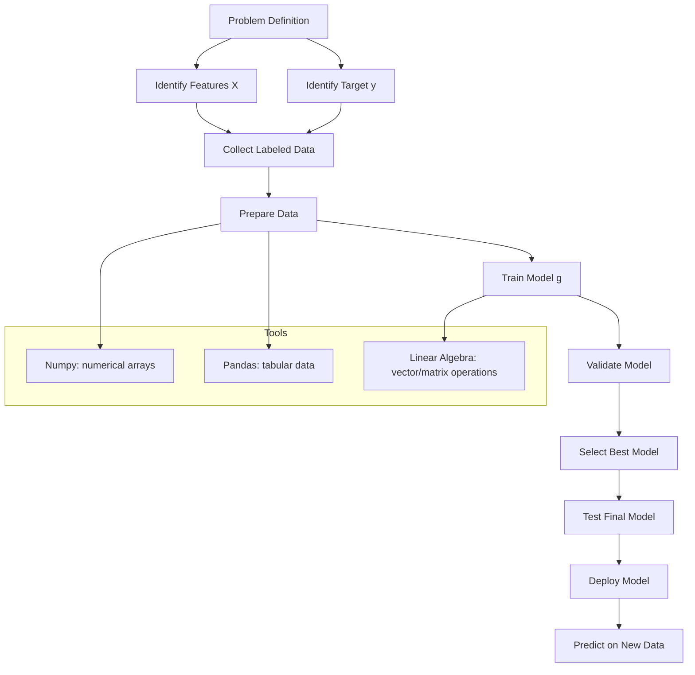

# 1. Title

# Machine Learning Foundations: Problem Framing, Supervised Learning, Tools, and Core Python Libraries

---

# 2. Overview

This set of notes covers the foundational ideas needed before building practical machine learning systems:

- How to frame a prediction problem using **features** and a **target variable**
- The difference between **rule-based systems** and **machine learning systems**
- Why the described examples are examples of **supervised learning**
- How machine learning fits into a larger **end-to-end workflow**
- The role of **model selection** and why data splitting matters
- The core Python tools used in the workflow:
  - `numpy` for numerical computation
  - basic **linear algebra** operations
  - `pandas` for tabular data processing
- Preparation for a practical project: **car price prediction**

These concepts form the conceptual and technical base for later hands-on machine learning work.

---

# 3. Key Concepts

## 3.1 Features and Target Variable
- **Features** are the input variables describing an object or event.
- The **target variable** is the value you want to predict.

## 3.2 Machine Learning Model
- A **model** is a function learned from data that maps features to predictions.
- Once trained, it can predict outputs for new, unseen examples.

## 3.3 Rule-Based Systems vs. Machine Learning
- **Rule-based systems** rely on manually written if/else logic.
- **Machine learning systems** learn patterns automatically from data.

## 3.4 Supervised Learning
- A learning setup where training data includes both:
  - inputs/features
  - known target values

## 3.5 End-to-End Machine Learning Workflow
- Business understanding
- Data understanding
- Data preparation
- Modeling
- Deployment

## 3.6 Model Selection and Data Splitting
- Data is split into separate subsets to evaluate models fairly and avoid accidental overfitting to one split.

## 3.7 Numpy
- Python library for efficient numerical computation with arrays and matrices.

## 3.8 Linear Algebra for Machine Learning
- Core operations include:
  - vector-vector multiplication
  - matrix-vector multiplication
  - matrix-matrix multiplication

## 3.9 Pandas
- Python library for working with tabular data using **DataFrames**.

---

# 4. Detailed Explanations and Examples

## 4.1 Framing a Prediction Problem

A common machine learning task is to predict one quantity from other known quantities.

### Example: Car Price Prediction
Suppose you want to estimate the price of a car.

- **Features**: characteristics of the car
  - brand
  - model
  - year
  - mileage
  - engine size
  - fuel type
  - condition
- **Target variable**: car price

The features are what you already know about the car. The target is what you want to estimate.

### Why this matters
Correct problem framing is essential because machine learning systems depend on clearly defined inputs and outputs. If the target is not well-defined, training cannot work properly.

### How it works
You collect examples where:
- the car’s features are known
- the selling price is known

These examples are used to train a model that learns a relationship between features and price.

### Practical use
Once trained, the model can estimate the price of a new car where the price is unknown.

```python
# Conceptual example
features = {
    "brand": "Audi",
    "year": 2016,
    "mileage": 45000,
    "engine_size": 2.0,
}

# After training, the model predicts a price
predicted_price = 23000
```

---

## 4.2 What a Machine Learning Model Does

A machine learning model is a learned function that maps input features to output predictions.

Conceptually:

\[
g(X) \rightarrow \hat{y}
\]

Where:
- `X` = feature matrix
- `g` = model
- `\hat{y}` = predicted target value

### Why this matters
The model is the reusable artifact produced by training. Instead of manually writing logic for every case, you train once and use the learned model repeatedly.

### How it works
During training, the algorithm analyzes examples and extracts statistical patterns from the input data. Those patterns become the model.

### When to use it
Use a trained model when:
- you have historical examples
- the target is known for training data
- you need predictions for new unseen cases

### Limitation
The model can only learn patterns present in the training data. If the data is poor, incomplete, or biased, the model will reflect that.

---

## 4.3 Rule-Based Systems vs. Machine Learning

### Rule-Based Systems
In a rule-based system, humans manually define decision logic.

Example for spam detection:
- If an email contains “free money” and “urgent,” mark it as spam.
- If it contains too many suspicious links, mark it as spam.

### Limitations of rule-based systems
- Rules become hard to manage as complexity grows
- Edge cases accumulate
- Maintaining the system becomes messy
- Humans must continuously update the logic

### Machine Learning Alternative
Instead of manually encoding rules, you provide training data and let the model discover patterns.

For spam detection:
- Input features could include word frequencies, sender behavior, links, formatting, and other signals
- Target variable: spam or not spam

### Why this matters
Machine learning is often preferable when:
- the rules are too complex to write manually
- patterns are subtle
- the system must adapt from data rather than from hand-written logic

### Tradeoff
Rule-based systems are often simpler, more interpretable, and useful when logic is explicit. Machine learning is more flexible but depends on data quality and model validation.

---

## 4.4 Supervised Learning

Both car price prediction and spam detection are examples of **supervised learning**.

### Definition
Supervised learning is a machine learning setting where the training data includes:
- inputs/features `X`
- known outputs/labels `y`

The model learns a mapping from inputs to outputs.

### Why it matters
Supervised learning is one of the most practical and widely used machine learning paradigms. It is the basis for many classification and regression systems.

### How it works
1. Provide labeled examples
2. Train a model on the examples
3. Use the model to predict outputs for new inputs

### Example structure
- `X`: feature matrix
- `y`: target values
- `g(X)`: model prediction

### Use cases
- Predicting house prices
- Predicting spam emails
- Predicting customer churn
- Predicting disease risk from patient records

### Important limitation
Supervised learning requires labeled data. If labels are unavailable, other methods may be more appropriate.

---

## 4.5 Machine Learning as Part of a Larger Workflow

Machine learning is only one step in a broader process.

### Major stages
1. **Business understanding**
   - Define the real-world problem
   - Clarify the success criteria
2. **Data understanding**
   - Identify available data sources
   - Understand what is measurable
3. **Data preparation**
   - Clean and transform data
   - Format data so it can be used by a model
4. **Modeling**
   - Train candidate models
   - Compare performance
5. **Deployment**
   - Put the model into use
   - Make predictions in a real system

### Why this matters
A strong model is not useful if:
- the business problem is unclear
- data is unusable
- the model is never deployed

### Engineering consideration
The model itself is often only a small part of the total system. Most effort can go into data preparation, validation, integration, and deployment.

---

## 4.6 Model Selection and Data Splitting

When comparing models, you do not want to choose one based only on how well it fits the training data.

### Why split the data?
If you evaluate on the same data used for training, results can be misleading. A model may appear strong simply because it memorized the data.

### Common split strategy
Data is divided into separate parts:
- **Training set**: used to fit the model
- **Validation set**: used to compare models and choose the best one
- **Test set**: used for final, unbiased evaluation

### Why validation matters
The validation set helps identify the best model without directly using the test set for decision-making.

### Why test matters
The test set provides an estimate of how the chosen model will perform on unseen data.

### Practical warning
If you repeatedly check performance on the test set while making design decisions, the test set is no longer a truly unbiased evaluation.

---

## 4.7 Environment Setup for the Course Workflow

A typical machine learning workflow in Python depends on a few standard libraries.

### Core packages mentioned
- `numpy`
- `pandas`
- `scikit-learn`

A practical way to get these installed is via **Anaconda**, which bundles many data science packages together.

### Cloud-based environment option
Instead of running locally, you can also use a server or cloud environment such as AWS or another cloud provider.

### Why this matters
A stable environment reduces setup friction and makes it easier to reproduce results.

### Engineering consideration
For learning and prototyping, a local setup with Anaconda is often easiest. For scalable or collaborative work, cloud environments may be preferable.

---

## 4.8 Numpy for Numerical Computation

`numpy` is the standard Python library for numerical arrays and efficient mathematical operations.

### What it is used for
- vectors
- matrices
- multidimensional arrays
- fast numerical operations

### Why it matters
Machine learning relies heavily on linear algebra and numeric computation. Python lists are not efficient enough for most ML workflows.

### How it works
`numpy` stores data in array structures optimized for computation and supports vectorized operations.

```python
import numpy as np

a = np.array([1, 2, 3])
b = np.array([4, 5, 6])

result = a + b
# result = [5, 7, 9]
```

### Practical benefit
Vectorized operations are faster, cleaner, and closer to the mathematical notation used in machine learning.

---

## 4.9 Linear Algebra Operations

Linear algebra is central to machine learning because many algorithms work on vectors and matrices.

### Vector-vector multiplication
Two vectors can be combined through multiplication in a mathematically defined way, often used in dot products.

### Matrix-vector multiplication
A matrix can transform a vector into another vector.

Conceptually:

\[
u \cdot v
\]

or

\[
U v
\]

depending on whether the inputs are vectors or matrices.

### Matrix-matrix multiplication
Two matrices can be multiplied to produce a new matrix.

### Important insight
These operations are not just abstract math. They are how many machine learning computations are implemented efficiently.

### Why this matters
Understanding these operations makes ML formulas less intimidating and helps you reason about how models actually compute predictions.

### Practical engineering note
Many matrix operations can be decomposed into combinations of smaller vector operations. This helps build intuition and supports efficient implementation.

```python
import numpy as np

U = np.array([[1, 2],
              [3, 4]])

v = np.array([5, 6])

result = U @ v
# result is the matrix-vector product
```

---

## 4.10 Pandas for Tabular Data

`pandas` is a Python library for working with table-like data.

### Main abstraction: DataFrame
A **DataFrame** represents data in rows and columns, similar to a spreadsheet or SQL table.

### Why it matters
Most real-world machine learning data is tabular:
- customer data
- transactions
- product catalogs
- car listings
- medical records

### Common operations
- loading data
- filtering rows
- selecting columns
- handling missing values
- computing aggregates
- joining tables
- transforming columns

```python
import pandas as pd

df = pd.read_csv("cars.csv")

# Select columns
features = df[["year", "mileage", "engine_size"]]

# Target column
target = df["price"]
```

### Practical benefit
Pandas is the standard tool for preparing structured datasets before modeling.

### Limitation
For very large datasets, memory usage can become an issue, and more scalable tools may be needed.

---

# 5. Mermaid Diagram



---

# 6. Common Pitfalls

## Problem framing issues
- Confusing features with the target variable
- Choosing a target that is not measurable or not available for training

## Rule-based system issues
- Hard-coding too many conditions
- Letting rules grow without structure
- Assuming rules will scale to messy real-world data

## Supervised learning issues
- Trying to train without labeled examples
- Using labels that are noisy, incomplete, or inconsistent

## Model selection issues
- Evaluating only on training data
- Using the test set repeatedly during model development
- Ignoring the need for a separate validation step

## Numerical computation issues
- Using Python lists instead of `numpy` arrays for matrix-heavy work
- Misunderstanding matrix dimensions during multiplication

## Tabular data issues
- Not cleaning columns before modeling
- Ignoring missing values
- Assuming every column is already model-ready

## Environment issues
- Installing incompatible package versions
- Mixing local and cloud environments without reproducibility

---

# 7. Best Practices

- Start by clearly defining the business problem before touching the model.
- Separate **features** from the **target** explicitly.
- Use labeled data carefully and verify label quality.
- Keep training, validation, and test data separate.
- Use `numpy` for efficient numerical operations.
- Use `pandas` for inspecting and transforming tabular data.
- Learn the basic linear algebra behind models; it improves debugging and intuition.
- Treat deployment as part of the project, not an afterthought.
- Prefer reproducible environments such as Anaconda or a well-managed cloud setup.
- Validate model choice with data you did not train on.
- Expect data preparation to take significant effort.

---

# 8. Key Takeaways

- Machine learning starts with a clear mapping from **features** to a **target variable**.
- A trained **model** learns patterns from data and can predict outcomes for new examples.
- **Rule-based systems** depend on human-written logic; **machine learning** learns patterns automatically.
- The car price and spam examples are both cases of **supervised learning** because the target is known in the training data.
- Machine learning is only one part of a larger pipeline that includes business understanding, data preparation, and deployment.
- Proper **data splitting** is essential for choosing models fairly and evaluating generalization.
- `numpy`, linear algebra, and `pandas` are foundational tools for practical machine learning work.
- Understanding these foundations makes the later project work much easier.

---

# 9. Potential Project Ideas

- **Car price prediction**
  - Predict used car prices from structured listing features.
- **Spam email classifier**
  - Build a supervised classifier using text-derived features.
- **House price estimator**
  - Predict property values from size, location, and condition.
- **Customer churn prediction**
  - Predict whether a customer is likely to leave a service.
- **Product demand forecasting**
  - Predict demand from historical and product features.
- **Loan risk classification**
  - Predict whether an applicant is likely to default.
- **Simple data analysis pipeline**
  - Load CSV data with `pandas`, clean it, and transform it into model-ready features.
- **Linear algebra playground**
  - Implement vector, matrix-vector, and matrix-matrix multiplication with `numpy` to build intuition.

