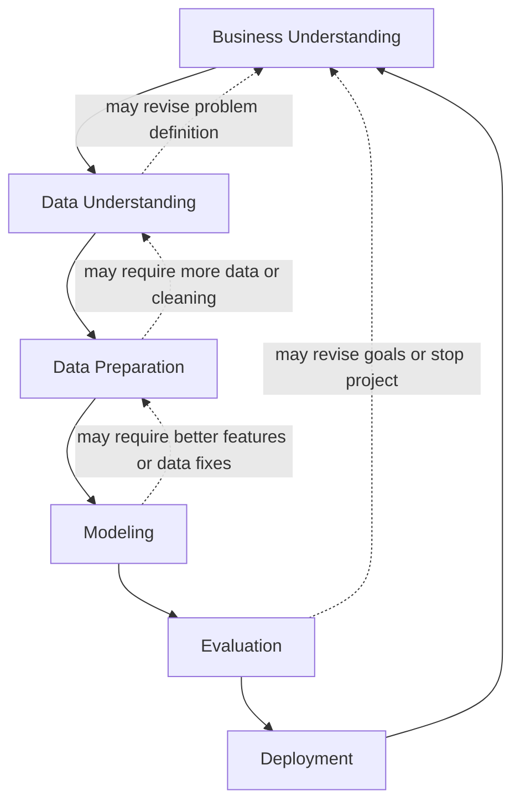

# Machine Learning Project Process: CRISP-DM

## Overview

Machine learning projects are not just about training a model. They require a structured process that moves from identifying the problem to collecting data, preparing it, modeling, evaluating results, and deploying a solution.

A widely used methodology for organizing machine learning and data mining projects is **CRISP-DM**, which stands for **Cross-Industry Standard Process for Data Mining**. Although it was developed in the 1990s, it remains highly practical because it provides a clear, repeatable workflow for managing ML projects.

This process is especially useful because ML projects often need:
- clear problem definition
- reliable data
- iterative experimentation
- evaluation against business goals
- production deployment and monitoring

A spam detection system is a good example of how this process works:
- emails are collected
- features are extracted
- a model predicts whether an email is spam
- emails above a threshold are filtered into the spam folder

---

## Key Concepts

### 1. CRISP-DM
A structured methodology for organizing machine learning projects.

**Why it matters**
- Helps teams work in a logical order
- Prevents jumping into modeling before understanding the problem
- Encourages iteration and feedback
- Connects technical work to business goals

---

### 2. Business Understanding
The step where the team defines the problem, decides whether ML is appropriate, and determines how success will be measured.

**Why it matters**
- Many problems do not need machine learning
- Success must be measurable
- Business value should guide technical work

---

### 3. Data Understanding
The step where the available data is inspected for quality, completeness, reliability, and usefulness.

**Why it matters**
- ML systems depend on data
- Bad or insufficient data leads to bad models
- Data issues often reveal hidden project constraints

---

### 4. Data Preparation
The step where raw data is transformed into a format suitable for machine learning.

**Why it matters**
- ML models typically require structured inputs
- Data cleaning and feature extraction are essential
- This is often one of the most time-consuming stages

---

### 5. Modeling
The step where one or more algorithms are trained and compared.

**Why it matters**
- This is where machine learning actually happens
- Different models may perform differently on the same data
- Feature quality often determines model performance

---

### 6. Evaluation
The step where model performance is checked against the original business goal.

**Why it matters**
- Good technical metrics do not always mean business success
- The original goal must be revisited
- Sometimes the project must be revised or stopped

---

### 7. Deployment
The step where the model is released into production and used by real users.

**Why it matters**
- A model is only useful if it works in practice
- Reliability, monitoring, and maintainability become critical
- Real-world feedback often reveals issues not visible offline

---

## Detailed Explanations and Examples

### 1. Business Understanding

At the start of a machine learning project, the first question is not “Which model should we use?” but rather:

- What problem are we solving?
- Why does it matter?
- Can success be measured?
- Is machine learning the right tool?

#### Example: Spam Detection
Suppose users complain that too much spam reaches their inbox.

At this stage, we ask:
- Is spam actually a significant problem?
- How many users are affected?
- How serious is the complaint?
- Would a rule-based system solve the problem well enough?
- Is machine learning necessary?

A business goal should be measurable. For example:

> Reduce the number of spam messages by 50%.

This is better than saying:
- “Improve spam detection”
- “Make email better”

Those statements are too vague to evaluate.

#### Engineering considerations
- If the problem is simple, a heuristic may be better than ML
- If the goal cannot be measured, the project is hard to evaluate
- The project should have a clear KPI or success metric

---

### 2. Data Understanding

Machine learning depends on data. If there is no usable data, there is no ML project.

At this stage, the team investigates:
- What data is available?
- Is it recorded correctly?
- Is it trustworthy?
- Is it large enough?
- Is it labeled correctly?
- Are there missing values or noisy labels?

#### Example: Spam Detection
If users click “spam” on emails, we need to ask:
- Are those clicks reliably tracked?
- Do users always report spam correctly?
- Do users sometimes mark legitimate messages as spam by mistake?
- Is the dataset large enough to train a useful model?

If the labels are noisy, the model learns noisy behavior.  
If the dataset is too small, the model may not generalize.

This stage may produce outcomes like:
- the current data is sufficient
- more data must be collected
- logging must be fixed
- labels need manual review
- the problem definition needs adjustment

#### Important point
Sometimes data understanding reveals that the original project idea needs revision. That means this stage can loop back to business understanding.

---

### 3. Data Preparation

After confirming that the data exists and is usable, the next step is to prepare it for modeling.

This usually includes:
- cleaning data
- removing noise
- handling incorrect labels
- structuring data into rows and columns
- extracting features
- producing a training matrix

This is often represented as a **pipeline**: a sequence of transformations that converts raw data into model-ready data.

#### Example: Spam Detection
Raw email data might include:
- sender
- recipient
- subject
- body
- timestamp
- user action
- spam label

From this, we may extract features such as:
- whether the word “deposit” appears
- number of links
- number of special characters
- presence of suspicious phrases
- sender reputation

These features become the input matrix `X`, while the label becomes `y`.

#### Why tabular format matters
Most classical machine learning models require structured numeric inputs. Raw emails are not directly usable by many models. They must be converted into a form the algorithm can process.

#### Engineering considerations
- Build reproducible preprocessing pipelines
- Keep raw data separate from transformed data
- Ensure training and inference use the same transformations
- Avoid leakage from labels into features

---

### 4. Modeling

This is the stage where actual machine learning happens.

The goal is to:
- train different models
- compare their performance
- choose the best option for the task

Possible models mentioned include:
- logistic regression
- decision trees
- neural networks

The best model is not always the most complex one. The choice depends on:
- data size
- feature quality
- required interpretability
- latency constraints
- deployment environment

#### Example: Spam Detection
You might train multiple models on the prepared email dataset and compare them using an appropriate validation method. If one model gives better spam classification performance, it becomes the candidate for deployment.

#### Why this is iterative
If performance is poor, the issue may not be the model itself. It may be:
- missing features
- poor labels
- insufficient data
- bad preprocessing

So modeling often loops back to data preparation.

---

### 5. Evaluation

After training, the model must be checked against the original business goal.

This is where we ask:
- Did we achieve the desired improvement?
- Does the model satisfy the KPI?
- Is the result good enough to justify deployment?
- Should the goal be revised?

#### Example: Spam Detection
If the business goal was to reduce spam by 50%, then evaluation checks whether the model actually achieves that target.

If the model only reduces spam by 30%, then:
- is that acceptable?
- should more work be done?
- is the goal unrealistic?
- should the project be stopped?

Evaluation is not only about technical performance. It is about whether the solution is useful in practice.

#### Important distinction
A model can have good offline metrics and still fail to meet the business objective. That is why evaluation must be tied to the original goal.

---

### 6. Deployment

Deployment is when the model is placed into production and used by real users.

In practice, deployment is often connected to evaluation, because many modern systems are evaluated through real-world usage.

#### Online evaluation
Instead of testing the model on all users at once, the system may be deployed to a small subset, such as 5% of users. This allows the team to observe:
- user behavior
- error rates
- stability
- business impact

If results are good, the model is rolled out more broadly.

#### Why deployment is more than model performance
At this stage, engineering concerns become central:
- monitoring
- reliability
- scalability
- maintainability
- incident handling
- production quality

A model that works in a notebook is not enough. It must also:
- run reliably
- be monitored for failures
- be maintainable over time
- scale appropriately

---

### 7. Iteration

Machine learning projects are not one-time linear processes. They are iterative.

A common strategy is:
1. start with a simple solution
2. deploy quickly
3. learn from results
4. improve the system
5. repeat

This helps teams:
- reduce risk
- validate value early
- avoid overengineering
- make incremental progress

#### Example
A simple spam classifier may be deployed first. Later, based on observed errors and feedback, the team may:
- add new features
- improve label quality
- try a more advanced model
- adjust the threshold

---

## Mermaid Diagram

---

## Common Pitfalls

- Starting with modeling before defining the business problem
- Using machine learning when a simpler rule-based system would work
- Defining vague success criteria that cannot be measured
- Trusting unreliable or noisy labels without inspection
- Assuming data is sufficient without checking volume and quality
- Building features without ensuring the same preprocessing is available in production
- Treating model training as the end of the project
- Ignoring deployment, monitoring, and maintainability
- Failing to iterate after real-world feedback
- Keeping the first version too complex instead of starting simple

---

## Best Practices

- Define a measurable business goal before training anything
- Ask explicitly whether ML is actually needed
- Inspect data quality early and manually when necessary
- Build reproducible preprocessing pipelines
- Represent training data in a clear tabular feature format
- Compare multiple models rather than assuming one will work best
- Evaluate results against the original business objective, not only technical metrics
- Deploy incrementally when possible, such as to a small user group first
- Monitor production systems carefully
- Start simple, then iterate based on feedback

---

## Key Takeaways

- CRISP-DM is a practical framework for organizing machine learning projects.
- The process begins with understanding the business problem, not choosing a model.
- Data quality and availability are central to success.
- Data preparation is often as important as modeling.
- Evaluation must be tied to the original business goal.
- Deployment requires strong engineering practices, not just a good model.
- ML projects are iterative and should improve through repeated cycles.

---

## Potential Project Ideas

- Build a spam detection prototype using a simple feature-based classifier
- Create a toy CRISP-DM workflow for classifying customer support tickets
- Design a data quality checklist for a classification dataset
- Implement a preprocessing pipeline that converts raw text into tabular features
- Compare a rule-based spam filter with a machine learning-based one
- Simulate an online evaluation process using a small user subset
- Write a project plan that maps each CRISP-DM stage to deliverables for a real ML use case