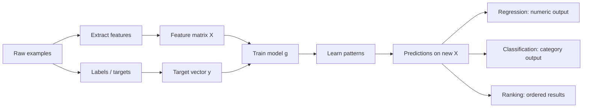

# Supervised Machine Learning: Definitions, Problem Types, and Data Representation

## Overview

Supervised machine learning is a learning setup where a model is trained using examples that already include the correct answer. The model sees input data and the corresponding target output, learns patterns from those pairs, and then uses those patterns to make predictions on new, unseen inputs.

This lesson covers:

- What supervised learning is
- How data is represented as `X` and `y`
- The role of features and target variables
- The training function `g`
- The main supervised learning problem types:
  - Regression
  - Classification
  - Binary classification
  - Multi-class classification
  - Ranking

---

## Key Concepts

### 1. Supervised Learning
- A machine learning approach where the algorithm learns from labeled examples.
- Each training example includes:
  - **Input features**: the information used for prediction
  - **Target label**: the correct output the model should learn to predict

### 2. Feature Matrix `X`
- The input data is usually stored in a **feature matrix** written as capital `X`.
- `X` is a **2D array** or table:
  - **Rows** = observations / samples / examples
  - **Columns** = features / attributes

### 3. Target Vector `y`
- The correct outputs are stored in a **target vector** written as lowercase `y`.
- `y` is typically a **1D array**:
  - One target value per row in `X`

### 4. Model Function `g`
- The model is represented as a function `g`.
- It takes `X` as input and produces predictions.
- The training objective is to make predictions as close as possible to `y`.

### 5. Supervised Learning Problem Types
- **Regression**: predict a numeric value
- **Classification**: predict a category
- **Binary classification**: predict one of two categories
- **Multi-class classification**: predict one of many categories
- **Ranking**: order items by relevance or preference

---

## Detailed Explanations and Examples

### 1. What Supervised Machine Learning Means

In supervised learning, you act like a teacher:

- You provide examples to the model
- Each example includes the correct answer
- The model learns from these labeled examples
- Once trained, the model generalizes to new data

#### Example: Car Price Prediction
You may have a dataset of cars with information such as:

- Make
- Model
- Mileage
- Year
- Engine size

For each car, you also have the actual price.

The model learns the relationship between car characteristics and price. Later, when it sees a new car with no known price, it can estimate that price.

#### Example: Spam Detection
You provide emails labeled as:

- `1` = spam
- `0` = not spam

The model learns patterns such as the presence of certain words or phrases. If a word like “deposit” appears frequently in spam emails, the model may learn that this is a useful signal.

---

### 2. How Data Is Represented: `X` and `y`

Supervised learning usually works with two core data structures:

#### Feature Matrix `X`
`X` contains the input information.

Example structure:

```python
X = [
    [feature_1, feature_2, feature_3],
    [feature_1, feature_2, feature_3],
    [feature_1, feature_2, feature_3],
]
```

- Each row is one training example
- Each column is one feature

#### Target Vector `y`
`y` contains the desired outputs:

```python
y = [0, 1, 0, 1, 1, 0]
```

- Each value corresponds to one row in `X`
- In binary classification, these values are often `0` and `1`

#### Why This Matters
This structure is the standard input format for many machine learning algorithms. Models do not directly reason about “emails” or “cars”; they operate on numerical representations of features and targets.

---

### 3. Training a Model as Learning a Function `g`

The goal is to learn a function:

```python
g(X) ≈ y
```

This means:

- Input: feature matrix `X`
- Output: predictions
- Goal: predictions should be as close as possible to the true target values in `y`

#### Engineering Interpretation
The model is not memorizing examples. It is learning patterns that help it make predictions on new data.

#### Example: Car Price Model
If the real price of a car is `1100` and the model predicts `1500`, that may still be acceptable depending on the use case. The goal is not always exact prediction; it is to get sufficiently close for the business problem.

---

### 4. Regression

Regression is the supervised learning problem where the target is a **number**.

#### Typical Outputs
- House price
- Car price
- Temperature
- Sales amount
- Demand forecasting value

#### How It Works
The model learns a relationship between features and a numeric target.

#### Example
For house price prediction, features may include:

- Number of square meters
- Number of rooms
- Distance to city center
- Distance to nearest subway station

The output is a value such as:

- `1000000`
- `350000`
- `750000`

#### When to Use
Use regression when the quantity you want to predict is continuous or numeric.

#### Tradeoff
Regression predictions are approximate. Even a good model may not predict the exact value.

---

### 5. Classification

Classification is the supervised learning problem where the target is a **category**.

#### Typical Outputs
- Spam / not spam
- Cat / dog / car
- Fraud / legitimate
- Approved / rejected

#### How It Works
The model learns patterns that separate one class from another and then assigns a category to new inputs.

#### Example: Image Classification
If the input is an image and the output is “car,” the model is solving a classification problem.

#### When to Use
Use classification when the answer belongs to one of a fixed set of labels.

---

### 6. Binary Classification

Binary classification is classification with exactly **two classes**.

#### Examples
- Spam vs not spam
- Fraud vs not fraud
- Churn vs no churn
- Disease vs no disease

#### Output Representation
Often encoded as:

- `1` = positive class
- `0` = negative class

In spam detection:

- `1` = spam
- `0` = not spam

#### Model Output
Many binary classifiers output a **probability** between `0` and `1`, which can then be converted into a class label using a threshold.

Example:

- Probability of spam = `0.87`
- If threshold = `0.5`, predict spam

#### Why It Matters
Binary classification is one of the most common machine learning task types in practice.

#### Tradeoff
Choosing the decision threshold affects precision and recall, so the threshold should match the business goal.

---

### 7. Multi-Class Classification

Multi-class classification is classification with more than two classes.

#### Examples
- Image belongs to:
  - car
  - cat
  - dog
- Email belongs to:
  - work
  - personal
  - spam
- Document topic:
  - sports
  - politics
  - finance

#### How It Works
The model chooses one class from several possible categories.

#### When to Use
Use multi-class classification when every example belongs to exactly one class among many classes.

#### Tradeoff
As the number of classes increases, the problem becomes more complex and may require more data.

---

### 8. Ranking

Ranking is a supervised learning setup where the goal is to **order items by relevance or preference**.

#### Why It Matters
Ranking is used in systems where returning the “best” items is more useful than simply assigning a category.

#### Common Use Cases
- Recommender systems
- Search engines
- Marketplace search
- Personalized item feeds

#### How It Works
A model scores each item, often with a relevance score. Then items are sorted by score and the top results are shown.

Example workflow:

1. Score each candidate item
2. Sort items by score
3. Return the top `k` results

#### Example: E-commerce Recommendations
A website may show products most likely to interest a user. The system evaluates many items and ranks them by the estimated likelihood that the user will click, purchase, or engage.

#### Example: Search Engines
Search systems rank documents by relevance to the query. For a query like “machine learning zoomcamp,” the most relevant pages should appear first.

#### Tradeoff
Ranking systems are often more complex than standard classification because they must consider relative ordering, not just independent labels.

---

### 9. Practical View of Features and Targets

A key step in supervised learning is deciding:

- What should be used as input features?
- What should be predicted as the target?

This is an engineering decision as much as a modeling decision.

#### Example: Spam Detection
Possible features:
- Presence of certain keywords
- Number of links
- Sender domain
- Email length

Target:
- Spam or not spam

#### Example: Car Price Prediction
Possible features:
- Brand
- Year
- Mileage
- Fuel type

Target:
- Price

The quality of the model depends heavily on how informative the features are.

---

## Mermaid Diagram



---

## Common Pitfalls

- **Confusing features with targets**
  - `X` contains inputs
  - `y` contains outputs

- **Using the wrong problem type**
  - Predicting a number is regression
  - Predicting a category is classification

- **Assuming labels are always human-readable**
  - Many models work with numeric encodings like `0` and `1`

- **Expecting exact predictions**
  - Especially in regression, close predictions may be sufficient

- **Ignoring feature quality**
  - Poor features often lead to poor models, even if the algorithm is strong

- **Treating ranking like classification**
  - Ranking is about ordering items, not only assigning labels

---

## Best Practices

- Clearly define the target before building the model
- Ensure every row in `X` matches exactly one entry in `y`
- Use numerical representations for model inputs when needed
- Choose the problem type based on the business objective
- For binary classification, think carefully about thresholds
- For ranking systems, evaluate relevance and ordering quality, not just accuracy
- Focus on feature quality and domain understanding
- Validate that labels are correct and consistently defined

---

## Key Takeaways

- Supervised learning uses labeled examples to train models.
- `X` is the feature matrix; `y` is the target vector.
- The model function `g` learns a mapping from features to targets.
- Regression predicts numbers.
- Classification predicts categories.
- Binary classification is a two-class special case of classification.
- Multi-class classification handles more than two categories.
- Ranking sorts items by relevance or preference.
- The most important step is matching the problem formulation to the prediction goal.

---

## Potential Project Ideas

- **House price prediction**
  - Regression problem using property features

- **Spam email classifier**
  - Binary classification using text-derived features

- **Movie genre classifier**
  - Multi-class classification from metadata or text

- **Customer churn prediction**
  - Binary classification using customer behavior data

- **Product recommendation system**
  - Ranking items for users based on relevance

- **Search result re-ranking**
  - Rank documents for a query based on predicted relevance

- **Car value estimator**
  - Regression using vehicle attributes

- **Image category classifier**
  - Multi-class classification for object recognition