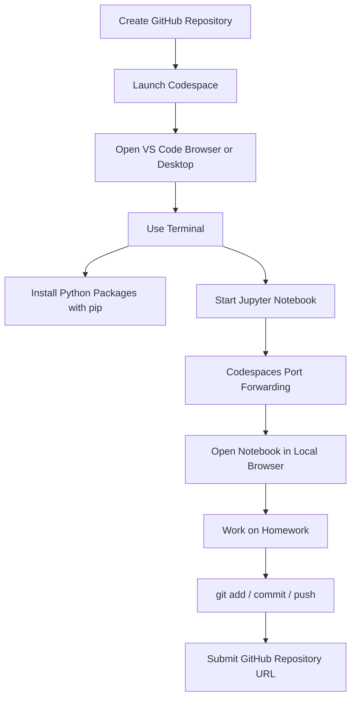

# GitHub Codespaces for Course Workflows and Homework Submission

## Overview

GitHub Codespaces provides a remote development environment directly from a GitHub repository. It is especially useful for course homework because it gives you:

- a ready-to-use Linux-based environment
- a browser-based editor or a desktop VS Code connection
- built-in terminal access
- automatic port forwarding for services like Jupyter
- simple Git integration for committing and pushing homework

The main value is reduced setup friction. Instead of configuring Python, notebooks, and dependencies locally, you can start from a repository and work in a consistent cloud environment.

---

## Key Concepts

### 1. GitHub Codespaces
A cloud-hosted development environment tied to a GitHub repository.

**Why it matters**
- Eliminates most local setup issues
- Ensures a reproducible environment
- Makes it easier to start homework quickly

**How it works**
- You create or open a repository on GitHub
- Launch a Codespace from the repository
- GitHub provisions a remote machine with a filesystem, terminal, and editor
- You work inside that environment as if it were local

**When to use it**
- For course assignments
- When you want a clean, disposable development environment
- When you need consistency across machines

**Tradeoffs**
- Depends on internet access
- Runtime and storage are remote
- May feel less direct than a local environment for some users

---

### 2. Remote VS Code Environment
Codespaces can be used in the browser or connected to the desktop version of VS Code.

**Why it matters**
- Gives flexibility in how you interact with the environment
- Desktop VS Code often feels more familiar and comfortable

**How it works**
- You can open the repository in browser-based VS Code
- Or connect the Codespace to local VS Code desktop using the GitHub Codespaces extension

**When to use it**
- Browser mode: convenient, no installation beyond the browser
- Desktop mode: better if you already use VS Code regularly

---

### 3. Terminal and Git Workflow in Codespaces
Codespaces includes a terminal for normal shell-based development.

**Why it matters**
- You can use standard Git commands
- You can install packages
- You can launch notebooks and other tools just as on a local Linux machine

**How it works**
- Open the terminal in VS Code
- Use `git status`, `git add`, `git commit`, and `git push`
- Any file changes are persisted in the repository after pushing

---

### 4. Python Environment Setup
A Codespace usually includes a working Python environment, but you still need to install project dependencies.

**Why it matters**
- Your notebooks and scripts depend on external libraries
- Installing the right packages ensures assignments run correctly

**How it works**
- Use `pip install` to install required packages
- Typical libraries for machine learning workflows include:
  - `jupyter`
  - `scipy`
  - `pandas`
  - `scikit-learn`
  - `seaborn`
  - later, possibly `xgboost` and `tensorflow`

---

### 5. Jupyter Notebook Access Through Port Forwarding
Jupyter can run inside the remote Codespace while being accessible from your local browser.

**Why it matters**
- Lets you use notebooks normally even though the compute is remote
- Avoids manual network configuration

**How it works**
- Start Jupyter in the Codespace terminal
- Codespaces detects the port, commonly `8888`
- The port is forwarded to your local machine
- Open the forwarded URL and use the notebook interface in your browser

---

### 6. Homework Repository Submission Workflow
A homework repository can be created and used as the submission artifact.

**Why it matters**
- Keeps homework version-controlled
- Makes it easy to submit a stable link
- Supports reproducible work and revision history

**How it works**
- Create a public GitHub repository for homework
- Add files such as notebooks, README, and data if needed
- Commit changes and push them to GitHub
- Submit the repository URL where required

---

## Detailed Explanations and Examples

### Creating a Homework Repository

A clean repository setup usually includes:

- a public GitHub repository
- a `README.md`
- a `.gitignore` configured for Python

This gives you a structured starting point and avoids committing irrelevant temporary files.

#### Typical repository creation flow
- create a new repository on GitHub
- choose a descriptive name such as `machine-learning-zoomcamp-homework`
- make it public if submission requires a public link
- initialize with a README
- select Python `.gitignore`

---

### Launching a Codespace

Once the repository exists:

1. open the repository on GitHub
2. select **Code**
3. choose **Codespaces**
4. create a new Codespace from the main branch

This provisions the remote environment and opens VS Code in the browser.

If you prefer desktop VS Code:

- install the GitHub Codespaces extension
- use the “Open in VS Code Desktop” option
- VS Code connects to the remote environment

---

### Working with the Terminal

The terminal behaves like a normal Linux shell.

#### Example: checking repository status
```bash
git status
```

If you modify a file, Git will show it as changed.

#### Example: adjusting the prompt for readability
If the prompt is too long, you can simplify it:

```bash
PS1='> '
```

This makes the terminal easier to read when long commands wrap on the line.

#### Example: committing changes
```bash
git add README.md
git commit -m "Update README"
git push
```

This workflow is identical to standard Git usage on a local machine.

**Engineering note**
- Always verify what is staged before committing
- Push after each meaningful checkpoint so your work is not lost

---

### Installing Dependencies

Use `pip` to install the libraries required for the course.

#### Example installation
```bash
pip install jupyter scipy pandas scikit-learn seaborn xgboost tensorflow
```

Not every course module needs every package immediately, but having the main dependencies ready avoids interruptions later.

**Why this matters**
- Notebooks may fail if packages are missing
- Installing early keeps the environment consistent for homework and practice

**Common limitation**
- Some packages may take time to install
- Large libraries such as TensorFlow or XGBoost may have heavier dependency footprints

---

### Starting Jupyter Notebook in Codespaces

After installing dependencies, start Jupyter in the terminal.

#### Example
```bash
jupyter notebook
```

When Jupyter starts, it runs in the remote Codespace, usually on port `8888`.

Codespaces detects that port automatically and forwards it. You then open the forwarded URL in your browser and paste the notebook token or full URL if needed.

**Why this matters**
- You can use notebook-based workflows without local installation
- The notebook interface remains familiar even though execution happens remotely

---

### Creating and Using Homework Files

A common structure is to create a folder for each assignment or module.

#### Example folder structure
```text
machine-learning-zoomcamp-homework/
├── README.md
├── homework.ipynb
└── 01_intro/
```

Inside the notebook, you can import libraries and read data normally.

#### Example notebook code
```python
import pandas as pd

df = pd.read_csv("hw_2024.csv")
df.head()
```

This is a standard workflow for homework tasks that involve data analysis and model building.

**Practical note**
- Make sure file paths are correct relative to the notebook location
- Refresh the file explorer if newly created folders do not appear immediately

---

### Renaming and Organizing Files

Sometimes notebook tools may not make renaming obvious. If needed, you can rename files from the file explorer or the terminal.

#### Example via terminal
```bash
mv old_name.ipynb homework.ipynb
```

Good naming helps when you later submit the repository or revisit the work.

---

### Committing and Submitting Homework

After finishing the assignment:

1. add the homework files to Git
2. commit the changes
3. push to GitHub
4. use the repository URL for submission

#### Example
```bash
git add .
git commit -m "Add homework solution"
git push
```

Then submit the repository link where required.

---

## Mermaid Diagram



---

## Common Pitfalls

### 1. Forgetting to install required packages
If `pandas`, `scikit-learn`, or notebook-related libraries are missing, notebooks may fail immediately.

### 2. Not using the Codespaces extension in desktop VS Code
If the extension is not installed, connecting to the remote Codespace from desktop VS Code may not work.

### 3. Confusing local and remote environments
Files and processes are running on the remote machine, not your local laptop. Always remember where Jupyter and Python are executing.

### 4. Missing port forwarding
If Jupyter is running but not visible in the browser, check the **Ports** panel and ensure the correct port is forwarded.

### 5. Forgetting to push changes
A commit is not enough for submission if the repository must contain the final homework version. Push changes to GitHub.

### 6. Using the wrong file path in notebooks
If the dataset file is not in the expected folder, `pd.read_csv()` will fail with a file not found error.

---

## Best Practices

### Keep the repository clean
- Add a `README.md`
- Use a Python `.gitignore`
- Organize homework into folders by module or assignment

### Commit frequently
- Save progress in small increments
- Use meaningful commit messages

### Install dependencies early
- Set up all commonly used packages before starting work
- Reduce interruptions during notebook execution

### Use port forwarding intentionally
- Confirm the notebook port is forwarded
- Access Jupyter via the forwarded link rather than trying to expose services manually

### Prefer reproducibility
- Make the repository self-contained where possible
- Ensure that others can open it and understand how to run the homework

### Keep terminal output readable
- If needed, simplify the shell prompt for long work sessions
- Reduce visual clutter to make commands easier to verify

---

## Key Takeaways

- GitHub Codespaces provides a remote development environment with minimal setup.
- You can use either browser-based VS Code or desktop VS Code connected to the Codespace.
- The terminal behaves like a normal Linux shell, so standard Git and Python workflows apply.
- Python dependencies can be installed with `pip` inside the Codespace.
- Jupyter runs remotely but can be accessed locally through port forwarding.
- A GitHub repository is a practical and version-controlled way to store and submit homework.
- The workflow is: create repository → launch Codespace → install dependencies → run notebook → commit and push → submit repository URL.

---

## Potential Project Ideas

### 1. Reproducible Homework Template
Create a reusable repository template for future assignments with:
- `.gitignore`
- README instructions
- notebook folder structure
- dependency installation notes

### 2. Codespaces Setup Guide for a Team or Class
Write a step-by-step onboarding guide showing:
- how to launch a Codespace
- how to install packages
- how to open Jupyter
- how to commit and push work

### 3. Notebook-Based Assignment Workflow
Build a sample homework repository with:
- one Jupyter notebook
- a small dataset
- example data loading and preprocessing steps

### 4. Submission Automation Helper
Create a lightweight script or checklist that:
- verifies changes are committed
- checks that the notebook exists
- confirms the correct branch and repository URL before submission

### 5. Environment Comparison Exercise
Document differences between:
- local Python setup
- Docker-based environment
- GitHub Codespaces

Focus on setup complexity, reproducibility, and convenience.

---