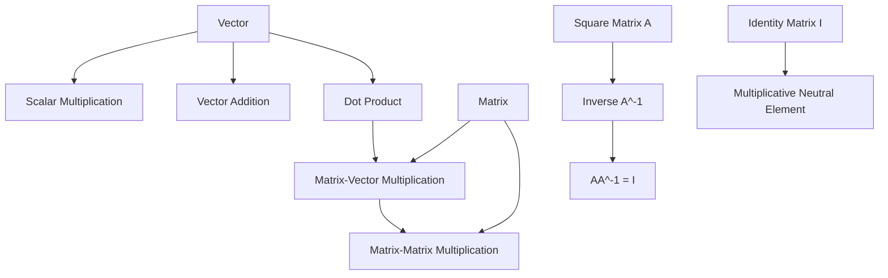

# Lesson 4: Linear Algebra for Machine Learning

## Overview

Linear algebra is a core mathematical toolkit for machine learning. In practice, it gives you the language and operations used to represent and transform data efficiently with vectors and matrices.

This lesson covers:

- Scalar multiplication of vectors
- Vector addition
- Vector-vector multiplication, also called the **dot product**
- Matrix-vector multiplication
- Matrix-matrix multiplication
- The **identity matrix**
- The **inverse of a matrix**

The key idea is that many machine learning computations can be expressed as combinations of these basic operations.

---

## Key Concepts

### 1. Vectors
A vector is an ordered collection of numbers. In linear algebra, vectors are usually written as **column vectors**.

Example:

```python
u = [
    2,
    4,
    5,
    6
]
```

In NumPy, vectors are often represented as 1D arrays, which may print like rows. That is a formatting convention, not a mathematical difference.

---

### 2. Scalar Multiplication
Multiplying a vector by a scalar means multiplying every element by that number.

Example:

```python
u = [2, 4, 5, 6]
2 * u = [4, 8, 10, 12]
```

---

### 3. Vector Addition
Two vectors of the same size can be added element-wise.

Example:

```python
u = [2, 4, 5]
v = [1, 0, 0]
u + v = [3, 4, 5]
```

---

### 4. Dot Product
The dot product multiplies two vectors of the same size and returns a **single number**.

Formula:

\[
u \cdot v = \sum_{i=1}^{n} u_i v_i
\]

Example:

- \(u = [2, 4, 5, 6]\)
- \(v = [1, 0, 0, 2]\)

Then:

\[
u \cdot v = 2\cdot1 + 4\cdot0 + 5\cdot0 + 6\cdot2 = 2 + 12 = 14
\]

---

### 5. Matrix-Vector Multiplication
A matrix-vector product is computed by taking the dot product of each row of the matrix with the vector.

If:

- \(U\) is a matrix with rows \(u_0, u_1, \dots, u_{k-1}\)
- \(v\) is a vector

Then:

\[
Uv =
\begin{bmatrix}
u_0 \cdot v \\
u_1 \cdot v \\
\vdots \\
u_{k-1} \cdot v
\end{bmatrix}
\]

The number of columns in the matrix must match the number of elements in the vector.

---

### 6. Matrix-Matrix Multiplication
A matrix-matrix product is built from matrix-vector products.

If:

- \(U\) is an \(m \times n\) matrix
- \(V\) is an \(n \times p\) matrix

Then \(UV\) is an \(m \times p\) matrix.

Each column of the result is:

\[
U v_j
\]

where \(v_j\) is the \(j\)-th column of \(V\).

---

### 7. Identity Matrix
The identity matrix, usually written as \(I\), is a square matrix with:

- 1s on the diagonal
- 0s everywhere else

It behaves like the number 1 for matrix multiplication:

\[
UI = U
\quad\text{and}\quad
IU = U
\]

---

### 8. Matrix Inverse
The inverse of a matrix \(A\), written \(A^{-1}\), is a matrix such that:

\[
AA^{-1} = I
\]

Only **square matrices** can have an inverse, and not every square matrix is invertible.

---

## Detailed Explanations and Examples

### Scalar Multiplication

If you multiply a vector by a scalar, every component is scaled.

```python
u = [2, 4, 5, 6]
result = 2 * u
# [4, 8, 10, 12]
```

#### Why it matters
Scaling is used constantly in machine learning for:

- learning rates
- normalization
- feature scaling
- gradient updates

---

### Vector Addition

Vector addition is performed element-wise and requires vectors of the same length.

```python
u = [2, 4, 5]
v = [1, 0, 0]
result = u + v
# [3, 4, 5]
```

#### Why it matters
Vector addition is the basis of:

- combining feature updates
- residual computations
- parameter updates in optimization

---

### Dot Product

The dot product is one of the most important operations in linear algebra for machine learning.

#### Formula

\[
u \cdot v = \sum_{i=1}^{n} u_i v_i
\]

#### Example

```python
u = [2, 4, 5, 6]
v = [1, 0, 0, 2]

result = 2 * 1 + 4 * 0 + 5 * 0 + 6 * 2
# 14
```

#### Geometric intuition
The dot product measures how aligned two vectors are:

- large positive value: vectors point in similar directions
- zero: vectors are orthogonal
- negative value: vectors point in opposite directions

#### Why it matters
Dot products appear in:

- linear regression
- neural networks
- similarity calculations
- projections
- cosine similarity
- matrix multiplication

---

### Python implementation of dot product

A manual implementation uses:

- a size check
- a running sum
- a loop over elements

```python
def dot_product(u, v):
    assert len(u) == len(v), "Vectors must have the same length"

    result = 0
    n = len(u)

    for i in range(n):
        result += u[i] * v[i]

    return result
```

#### Example usage

```python
u = [2, 4, 5, 6]
v = [1, 0, 0, 2]

dot_product(u, v)
# 14
```

#### NumPy equivalent

```python
import numpy as np

u = np.array([2, 4, 5, 6])
v = np.array([1, 0, 0, 2])

np.dot(u, v)
# 14
```

#### Common pitfall
Do not confuse:

- **element-wise multiplication**: `u * v`
- **dot product**: `np.dot(u, v)`

These are different operations.

---

### Matrix-Vector Multiplication

A matrix-vector product is computed row by row.

If:

\[
U =
\begin{bmatrix}
u_0 \\
u_1 \\
u_2
\end{bmatrix}
\quad \text{and} \quad
v
\]

then:

\[
Uv =
\begin{bmatrix}
u_0 \cdot v \\
u_1 \cdot v \\
u_2 \cdot v
\end{bmatrix}
\]

#### Shape rule
If \(U\) has shape \((m, n)\), then \(v\) must have length \(n\).  
The output has shape \((m,)\).

---

### Python implementation of matrix-vector multiplication

```python
import numpy as np

def matrix_vector_mul(U, v):
    assert U.shape[1] == len(v), "Matrix columns must match vector size"

    m = U.shape[0]
    result = np.zeros(m)

    for i in range(m):
        result[i] = np.dot(U[i], v)

    return result
```

#### Example

```python
U = np.array([
    [1, 2, 3],
    [0, 1, 4],
    [2, 2, 2]
])

v = np.array([1, 0, 2])

matrix_vector_mul(U, v)
# array([7, 8, 6])
```

#### NumPy equivalent

```python
U.dot(v)
```

#### Why it matters
This operation is central to:

- linear models
- transforming feature vectors
- forward passes in neural networks

---

### Matrix-Matrix Multiplication

Matrix-matrix multiplication can be understood as repeated matrix-vector multiplication.

If \(V\) has columns \(v_0, v_1, \dots, v_{p-1}\), then:

\[
UV = [Uv_0 \;\; Uv_1 \;\; \dots \;\; Uv_{p-1}]
\]

#### Shape rule
If \(U\) is \((m, n)\) and \(V\) is \((n, p)\), then:

- the inner dimensions must match: \(n = n\)
- the result shape is \((m, p)\)

---

### Python implementation of matrix-matrix multiplication

```python
import numpy as np

def matrix_matrix_mul(U, V):
    assert U.shape[1] == V.shape[0], "Inner dimensions must match"

    m = U.shape[0]
    p = V.shape[1]
    result = np.zeros((m, p))

    for j in range(p):
        result[:, j] = U.dot(V[:, j])

    return result
```

#### Example

```python
U = np.array([
    [1, 2],
    [3, 4]
])

V = np.array([
    [5, 6],
    [7, 8]
])

matrix_matrix_mul(U, V)
# array([[19, 22],
#        [43, 50]])
```

#### NumPy equivalent

```python
U.dot(V)
```

#### Why it matters
Matrix-matrix multiplication is fundamental for:

- composing linear transformations
- deep learning layer computations
- batch operations on data

---

### Identity Matrix

The identity matrix \(I\) acts like multiplicative identity for matrices.

Example:

```python
import numpy as np

I = np.identity(3)
print(I)
```

Output:

```python
[[1. 0. 0.]
 [0. 1. 0.]
 [0. 0. 1.]]
```

If \(V\) is a \(3 \times 3\) matrix:

```python
V.dot(I) == V
I.dot(V) == V
```

#### Why it matters
The identity matrix is essential for:

- defining matrix inverses
- linear algebra proofs
- solving systems of equations
- numerical methods

---

### Matrix Inverse

A matrix inverse satisfies:

\[
A A^{-1} = I
\]

Only square matrices can be invertible.

#### Example with NumPy

```python
import numpy as np

V = np.array([
    [1, 2, 3],
    [0, 1, 4],
    [2, 2, 2]
])

V_inv = np.linalg.inv(V)
print(V_inv)

print(V.dot(V_inv))
```

The product should be the identity matrix.

#### Why it matters
Matrix inverses are useful in:

- solving linear systems
- derivations in linear regression
- analytical expressions in optimization and statistics

#### Important limitation
Not every square matrix has an inverse. A matrix may be singular, meaning it cannot be inverted.

---

## Mermaid Diagram



---

## Common Pitfalls

- **Confusing element-wise multiplication with dot product**
  - In NumPy, `u * v` is element-wise
  - Dot product requires `np.dot(u, v)` or `u.dot(v)`

- **Shape mismatch**
  - Dot product and matrix multiplication require compatible dimensions
  - Always check vector lengths and matrix inner dimensions

- **Forgetting that vectors are often treated as columns in linear algebra**
  - NumPy may display 1D arrays like rows
  - The mathematical convention is usually column vectors

- **Assuming every square matrix is invertible**
  - Some square matrices are singular and have no inverse

- **Using inverse when not needed**
  - In numerical computation, solving a linear system is often better than explicitly computing an inverse

---

## Best Practices

- Check shapes before performing any linear algebra operation
- Use NumPy built-ins such as:
  - `np.dot`
  - `array.dot(...)`
  - `np.identity`
  - `np.linalg.inv`
- Prefer matrix operations over manual loops when performance matters
- Keep track of whether your data represents:
  - a vector
  - a row
  - a column
  - a matrix
- Use matrix notation carefully, especially when translating formulas to code

---

## Key Takeaways

- Scalar multiplication scales every element of a vector.
- Vector addition is element-wise and requires equal lengths.
- The dot product returns a single number and is central to linear algebra.
- Matrix-vector multiplication is computed row by row using dot products.
- Matrix-matrix multiplication is built from matrix-vector multiplication.
- The identity matrix behaves like 1 for matrix multiplication.
- A matrix inverse exists only for square matrices and satisfies \(AA^{-1} = I\).

---

## Potential Project Ideas

- Implement dot product, matrix-vector multiplication, and matrix-matrix multiplication from scratch using Python lists.
- Compare your implementations against NumPy results.
- Write a small utility that checks whether matrix shapes are compatible for multiplication.
- Build a function that verifies whether a matrix is approximately invertible by checking \(AA^{-1} \approx I\).
- Explore how matrix multiplication is used in linear regression by writing a simple prediction function.
- Create a notebook that visualizes vector addition, scaling, and dot product geometrically.

